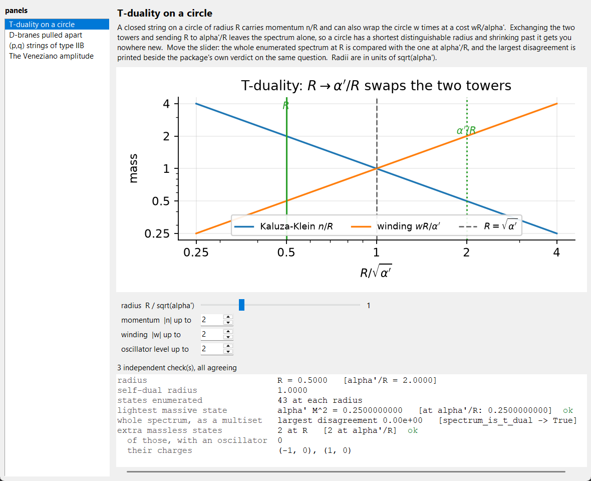

# stringsim

A simulation toolkit for string theory. It solves the worldsheet equations
numerically, counts the quantum states, identifies which particle each vibration
is, and reproduces the classic results — the critical dimension, the Regge
trajectory, T-duality, orbifold twisted sectors, all five superstring theories
and the two heterotic lattices — as computed output rather than quoted facts.

It starts with the bosonic string, where every step can be watched, and builds
up: circle, torus, orbifold, superstring, heterotic, heterotic on a torus. Both
worldsheet fields are simulated -- the bosons obey a wave equation and are
integrated with a leapfrog, the fermions obey a transport equation and are
integrated with Lax-Wendroff, and the two sectors of the superstring come out of
a single sign at the end of the string. Each
layer is required to reproduce the one below it — the torus at `d = 1` must give
the circle module's spectrum state for state, and it is tested that way.

The design rule throughout: **anything that can be checked two ways is checked
two ways.** The mode expansion is validated against a finite-difference solution
of the same wave equation; the light-cone mass formula against the integrated
Noether charges; the amplitude's poles against the independently counted
spectrum; the critical dimension against the conformal anomaly. The test suite
is where those cross-checks live.

```
python -m stringsim                       # summary of everything, in one screen
python -m stringsim --gui                 # the same, with the parameters live
python examples/01_vibrating_string.py    # animations + constraint residuals
python -m pytest                          # 1415 checks
```

---

## Install

No install is needed to run the examples or the tests — both put `src/` on the
path themselves. For an editable install:

```bash
pip install -e ".[dev]"
```

Requires Python ≥ 3.10, numpy, scipy and matplotlib.  The window adds no
dependency of its own — it needs tkinter, which is in the standard library,
though a few Linux distributions package it separately (`apt install
python3-tk`).  Everything else works without it.

---

## Conventions

| quantity | convention |
|---|---|
| metric | mostly plus, `diag(-1, +1, ..., +1)` |
| Regge slope | `alpha'`, free; `alpha_prime = 1` by default |
| string length | `l_s = sqrt(alpha')` |
| tension | `T = 1 / (2 pi alpha')` |
| open string | `sigma` in `[0, pi]`, `alpha_0 = sqrt(2 alpha') p` |
| closed string | `sigma` in `[0, 2 pi)`, `alpha_0 = alpha_tilde_0 = sqrt(alpha'/2) p` |
| dimension | `D = 26` by default; nothing hard-codes it |

Everything is set by one frozen dataclass:

```python
from stringsim import Conventions
conv = Conventions(alpha_prime=1.0, dim=26)
```

---

## What is in it

### 1. Classical worldsheet dynamics — `stringsim.classical`

In conformal gauge the embedding satisfies the free wave equation, so every
solution is a superposition of normal modes. Two independent routes are
provided, and they agree.

**Analytic mode expansions** (`modes.py`) for the open (Neumann) and closed
(periodic) string, with `X`, `dX/dtau` and `dX/dsigma` in closed form.

**Light-cone gauge** (`lightcone.py`) is where the physics enters. Fixing
`X^+ = 2 alpha' p^+ tau` turns the Virasoro constraints from conditions into
*definitions* of the minus components,

```
alpha_n^-  =  (1 / sqrt(2 alpha') p^+) . (1/2) sum_m alpha_{n-m}^i alpha_m^i
```

so the transverse amplitudes are free data and the string is physical by
construction. The `n = 0` component of that same equation is the mass shell, and
it returns, with nothing else put in,

```
alpha' M^2  =  sum_{m >= 1} |alpha_m^i|^2  =  N
```

Measured on the assembled `D`-dimensional solution, the constraint residuals
come out at **5e-16** and the momentum integral reproduces `p^mu` to better
than **1e-13**.

**Finite-difference evolution** (`evolve.py`) goes the other way: pluck a string,
release it, and integrate. Neumann, Dirichlet (an endpoint on a D-brane), mixed
and periodic ends are supported. The scheme is second-order — measured
convergence ratios 4.00, 4.00, 4.00 under grid halving — and exact to round-off
at Courant number 1, where it becomes d'Alembert's solution.
`mode_spectrum()` then reads the harmonics back off a snapshot: a midpoint pluck
gives `n = 0, 2, 6, 10, ...` falling like `1/n^2`, the classical guitar-string
answer, because it is the same equation.

**The rotating string** (`rotating.py`) is the exact solution

```
X^0 = A tau,   X^1 = A cos(tau) cos(sigma),   X^2 = A sin(tau) cos(sigma)
```

Its endpoints move at exactly the speed of light (measured: `1.0000`), and
integrating the Noether currents gives `M = A/(2 alpha')`, `J = A^2/(4 alpha')`,
so

```
J = alpha' M^2        (agreement to 1e-14 over a range of amplitudes)
```

That is where the Regge slope gets its name — and it is the same `alpha'` that
sets the spectrum spacing and the amplitude's pole spacing.

### 2. The quantum spectrum — `stringsim.quantum`

**Counting** (`partition.py`). The number of states at level `N` is the
coefficient of `q^N` in `prod (1-q^n)^{-(D-2)}`, computed in exact integer
arithmetic:

```
d_N  =  1, 24, 324, 3200, 25650, 176256, 1073720, ...
```

`d_400` has 92 digits, which is why floats are not used. The Dedekind eta
function is included and its modular transformation
`eta(-1/tau) = sqrt(-i tau) eta(tau)` verified to **3e-16**.

**Where D = 26 comes from** (`zeta.py`). The zero-point energy needs
`sum_n n`, and `zeta(-1) = -1/12` is extracted here from a genuine convergent
sum with an exponential cutoff, by removing the `1/eps^2` divergence and fitting
what is left:

```
measured  -0.083333333328     exact  -0.083333333333     error  4.9e-12
```

Hence `a = (D-2)/24`, and `a = 1` — forced by Lorentz invariance, since a
massive vector cannot be built from only `D-2` oscillators — gives `D = 26`. The
conformal-anomaly route, `c = D - 26 = 0`, is implemented separately and agrees;
the superstring versions give `D = 10` by both routes.  Both of those are
anomaly arguments; section 10 derives the same 26 a third time, from whether
the physical states have positive norm, and gets `c = D` out of a commutator
rather than a formula.

**Which particle is which vibration** (`states.py`). The little group fixes the
identification — `SO(D-2)` for a massless state, `SO(D-1)` for a massive one:

| level | `alpha' M^2` | states | content |
|---|---|---|---|
| 0 | −1 | 1 | tachyon |
| 1 | 0 | 24 | **photon**, vector of `SO(24)` |
| 2 | 1 | 324 | massive spin 2, symmetric traceless of `SO(25)` |
| 3 | 2 | 3200 | spin 3 (2900) ⊕ 2-form (300) |

and for the closed string at the massless level, `24 x 24 = 576` splits as

| piece | dimension | field |
|---|---|---|
| symmetric traceless | 299 | **graviton** `g_mu nu` |
| antisymmetric | 276 | Kalb–Ramond `B_mu nu` |
| trace | 1 | dilaton `Phi` |

The graviton is not inserted by hand. Every closed string has that state, which
is the reason string theory *contains* gravity. The tests check that the named
irreducible pieces exhaust the independently counted degeneracy — nothing left
over — at every level where a decomposition is given.

**Hagedorn temperature.** Degeneracies growing like `exp(4 pi sqrt(N))` mean the
canonical partition function diverges above a finite temperature. Fitted from
the computed degeneracies at `N <= 400`:

```
beta_H measured 12.5298   against  4 pi = 12.5664     (0.3%)
```

**Superstring.** The GSO-projected degeneracies `8, 128, 1152, 7680, ...` are
computed, and Jacobi's *aequatio identica satis abstrusa*
`theta_3^4 = theta_2^4 + theta_4^4` is verified to **exactly zero in integers**
over 80 orders — the statement that bosons and fermions are equinumerous at
every mass level, the first fingerprint of spacetime supersymmetry.

### 3. A circle: winding and T-duality — `stringsim.compactification.circle`

Put one direction on a circle of radius `R`. Momentum is quantised, `n/R`, as it
would be for a point particle; but a string can also *wind*, at energy
`wR/alpha'`, and that has no point-particle counterpart:

```
M^2 = (n/R)^2 + (wR/alpha')^2 + (2/alpha')(N + Ntilde - 2),    N - Ntilde = n w
```

The spectrum is invariant under `R -> alpha'/R` with `n <-> w` — verified as a
multiset identity across radii and values of `alpha'`. A circle smaller than
`sqrt(alpha')` is a circle you have already seen; there is a shortest
distinguishable radius.

At the self-dual radius the code finds, by enumeration, eight extra massless
states: four with `(n,w) = (±1,±1)` carrying one oscillator, which enlarge
`U(1)_L x U(1)_R` to `SU(2)_L x SU(2)_R`, and four with `(n,w) = (±2,0), (0,±2)`
and no oscillators — the bosonic string's tachyon tower passing through zero
mass. The two kinds are labelled separately rather than lumped together.

### 4. A torus: the Narain lattice and `O(d,d;Z)` — `stringsim.compactification.torus`

Compactifying `d` directions is not just `d` copies of the circle. A constant
metric `G_ij` **and** a constant antisymmetric `B_ij` are now available — `d^2`
moduli in all — and the duality group grows from `R -> alpha'/R` to the full
`O(d,d;Z)`. With `Z = (w, n)` the charge vector and `E = G + B`,

```
l_L = (1/sqrt2) G^{-1/2} (n + E^T w),      l_R = (1/sqrt2) G^{-1/2} (n - E w)

alpha' M^2 = l_L^2 + l_R^2 + 2(N + Ntilde - 2),   l_L^2 - l_R^2 = 2 n.w = 2(N - Ntilde)
```

**Two quadratic forms on one lattice.** The mass is `Z^T H Z` with the
generalized metric `H(G,B)`, positive definite and moduli-dependent; level
matching is `Z^T eta Z` with `eta = [[0,I],[I,0]]`, indefinite and *fixed*. The
Narain lattice `Gamma_{d,d}` is even (norms `2 n.w`) and self-dual
(`|det eta| = 1`) at every point in moduli space, which is what keeps the
one-loop amplitude modular invariant while the moduli vary.

**The first thing checked is the old case.** At `d = 1` the torus spectrum
agrees with `circle.py` state for state, across radii and across values of
`alpha'` — 43 level-matched states each time, identical multisets. A
generalisation that cannot reproduce what it generalises is not one.

**T-duality.** Three kinds of generator: a lattice basis change, an integer
shift of `B` (so `B` is periodic — a modulus with no large-field limit), and
the factorized duality exchanging `w^k <-> n_k`, which at `d = 1` is exactly
`R -> alpha'/R`. Each is verified to be an integer matrix preserving `eta`, and
to leave the spectrum invariant.

> A trap worth recording. The obvious test — enumerate the spectrum before and
> after, compare as multisets — **gives a false negative** for the basis change
> and the `B` shift. The enumeration is truncated to a box `|n|,|w| <= k`, and
> those generators shear the box, so states near the edge leave the window. The
> factorized dualities merely permute components and pass. `spectrum_is_dual`
> therefore follows each state through the charge map instead; the masses then
> agree to `1e-15` for every generator and for their products.

**The gauge group is a root system.** A massless vector needs
`(l_L^2, l_R^2) = (2, 0)` or `(0, 2)` — a lattice vector of squared length 2,
which is the standard normalisation for the roots of a simply laced algebra.
Because all roots have the *same* length, only `A`, `D`, `E` can appear from a
plain torus; `B_n`, `C_n`, `G_2`, `F_4` need orbifolds or Wilson lines.

The search is complete, not truncated: `l_R = 0` forces `n = E w` and
`l_L^2 = 2 w^T G w`, so `w^T G w = 1` bounds `w` outright.

| point in moduli space | roots per side | algebra |
|---|---|---|
| generic `T^2` | 0 | `u(1)^2` |
| one radius self-dual | 2 | `su(2) + u(1)` |
| self-dual `T^d` | `2d` | `su(2)^d` |
| `A_2` point of `T^2` | 6 | `su(3)` |

The `A_2` point is `G = [[1, -1/2], [-1/2, 1]]`, `B = [[0, 1/2], [-1/2, 0]]`,
chosen so that `w^T G w = 1` has six solutions *and* `E = G + B` is an integer
matrix, which is what makes `n = E w` an allowed momentum for each of them.

**Counting alone is not always enough**, and the code says so rather than
guessing: rank 3 with six roots is `su(2)^3` *or* `su(3) + u(1)`, and
`identify_algebra(3, 6)` returns both. `gauge_algebra` settles it from the
geometry — it splits the roots into connected components under
non-orthogonality, finding three orthogonal pairs rather than six coplanar
vectors. `figures/roots_su3.png` is that distinction drawn: a hexagon at 60
degrees, not two perpendicular pairs.

### 5. An orbifold: twisted sectors and the projection — `stringsim.compactification.orbifold`

Quotient the torus by a finite symmetry `theta` and two things happen at once.

**Untwisted states are projected.** Only `theta`-invariant states survive,
counted by the character projector `P = (1/N) sum_k theta^k`. What that removes
is physical: on `S^1/Z_2` the Kaluza-Klein gauge bosons `g_{mu i}` and `B_{mu i}`
carry one compact index, are odd, and disappear. Of the torus's 576 massless
states, 530 survive — 529 graviton/`B`/dilaton plus the radius modulus, with the
**46 vectors gone**. The compactification has no massless vectors from the
untwisted sector.

That number is computed twice: once by the character projector, which never
splits an index, and once by counting `(D-2-d)^2 + d^2` by hand. They agree for
`S^1/Z_2`, `T^2/Z_2` and `T^4/Z_2` (530, 488, 416). For a *rotation* rather than
a reflection, only the one compact pair with `lambda lambda* = 1` survives, and
`T^2/Z_3`, `Z_4`, `Z_6` all give `22^2 + 2 = 486`.

**Twisted sectors appear.** Strings closing only up to `theta^k` live at its
fixed points — `|det(1 - theta^k)|` of them — and carry fractional oscillator
modes, which shifts the ground-state energy to

```
a_k = 1 - (1/4) sum_j phi_j (1 - phi_j),      alpha' M^2 / 4 = N - a_k
```

with `exp(2 pi i phi_j)` the eigenvalues of `theta^k`. The `1/4` is not asserted:
a boson with modes `n + phi` has zero-point energy `(1/2) zeta(-1, phi)`, and
`regularised_shifted_sum` extracts `zeta(-1, a) = -B_2(a)/2` from a cut-off sum
exactly as `-1/12` was extracted for the untwisted string. Summing that over the
24 transverse bosons reproduces the closed form to `1e-7`, for every sector of
every orbifold in the table.

| orbifold | phases | `a_1` | fixed points |
|---|---|---|---|
| `S^1/Z_2` | 1/2 | 15/16 | 2 |
| `T^2/Z_2` | 1/2, 1/2 | 7/8 | 4 |
| `T^4/Z_2` | 1/2 (x4) | 3/4 | 16 |
| `T^2/Z_3` | 1/3, 2/3 | 8/9 | 3 |
| `T^2/Z_4` | 1/4, 3/4 | 29/32 | 2 |
| `T^2/Z_6` | 1/6, 5/6 | 67/72 | 1 |

The fixed points are located as well as counted — they are the classes of
`(1 - theta^k)^{-1} Lambda / Lambda` — and `figures/fixed_points_z3.png` draws
them in the hexagonal cell.

**Which orbifolds exist is not a free choice.** `theta` must be a lattice
automorphism that also preserves `G` and `B`, which is checked by pushing it
through the `O(d,d;Z)` machinery of the torus module and demanding the moduli
come back unchanged — a 90-degree rotation is fine on a square lattice and
rejected on a rectangular one. In two dimensions the crystallographic
restriction then leaves only `N = 1, 2, 3, 4, 6`, and
`crystallographic_orders` finds that by searching integer matrices rather than
quoting it.

**An honest negative result.** None of these orbifolds has a massless twisted
state: `a_k` never lands on the level lattice, so every twisted level is either
tachyonic or massive. The bosonic string keeps its instability, and the
quotient does not cure it.

**A twist need not act on space at all** — `stringsim.compactification.asymmetric`.
On the Narain lattice a twist is any `Omega` in `O(d,d;Z)` that also fixes the
moduli, and because it preserves `eta` and `H` it preserves `l_L^2` and `l_R^2`
separately: in the momentum frame it is a *pair* of rotations `(R_L, R_R)`. When
those differ there is no motion of the torus that produces it. The test is
sharp — with `Z = (w, n)` a diffeomorphism sends `w -> A w` and a `B`-shift
touches only the momentum, so both leave the upper-right block of `Omega` zero,
and T-duality is precisely the statement that it does not.

`H` is positive definite, so the automorphism group is **finite and searchable**
by backtracking over images of basis vectors:

| background | `|Aut|` | geometric | asymmetric | level-matched | left algebra |
|---|---|---|---|---|---|
| generic `S^1` | 2 | 2 | 0 | — | `u(1)` |
| self-dual `S^1` | 4 | 2 | 2 | 0 | `su(2)` |
| hexagonal `T^2` | 12 | 12 | 0 | — | `u(1)^2` |
| half self-dual `T^2` | 8 | 4 | 4 | 0 | `su(2) + u(1)` |
| self-dual `T^2` | 32 | 8 | 24 | 6 | `su(2)^2` |
| self-dual `T^3` | 384 | 48 | 336 | 84 | `su(2)^3` |

At the fully self-dual `T^d` that is `2^(2d) d!` with a geometric subgroup of
`2^d d!` — the signed permutations, `Aut` of `Z^d` itself. **Asymmetric twists
exist exactly where the gauge symmetry is enhanced**: no roots, no asymmetry, and
the ratio `|Aut| / |Aut_geom|` is the order of one side's Weyl group.

**Level matching decides which of them are usable.** A twisted sector needs
`L_0 - L_0bar` quantised in units of `1/N`, so `N (a_R - a_L)` must be an
integer, with the intercepts built from the phases exactly as the symmetric
machinery builds its own. Across every background above the condition holds
**precisely when the two phase multisets agree** — the left and right rotations
may be different rotations, but they must turn by the same angles. That came out
of the enumeration and the tests re-derive it rather than trusting it. A
geometric twist has `a_L = a_R` identically and so can never fail; the
self-dual circle's T-duality twist has `a_L = 1`, `a_R = 15/16` and misses by
`1/8`, which is why that orbifold needs a shift.

For the survivors `|det(1 - Omega)|` is always a perfect square, and its root is
the twisted-sector degeneracy — left- and right-movers each supply half of the
fixed-point count on the Narain lattice:

```
self-dual T^2   order 4   phi = (1/4, 3/4)        |det(1-Omega)| = 4    degeneracy 2
self-dual T^3   order 4   phi = (1/4, 1/2, 3/4)                   16               4
self-dual T^3   order 6   phi = (1/6, 1/2, 5/6)                    4               2
```


**And a twist may translate as well as turn.** Above, the self-dual circle's
T-duality twist was found to miss level matching by exactly `1/8` — which is
*why* such an orbifold needs a shift. `shifts_that_close` finds it.

With `Z -> Omega Z + v` two things change. The **order**: the element only
closes when `(1 + Omega + ...) v` lands back on the lattice, so a shift can
raise it. And the **condition**, which becomes

```
N [ (a_R - a_L) + <v,v>/2 ]  in  Z
```

`<v,v> = v^T eta v` is the only way the shift enters, and on a circle that is
`2 n w` — so a pure momentum or pure winding shift contributes nothing and can
never break anything, at any order, which the tests check across denominators.

Searching the rational shifts one denominator at a time:

| denominator | shifts that close it |
|---|---|
| 2 | none |
| 3 | none |
| 4 | `(1/4, 1/4)` and `(3/4, 3/4)`, both at order 4 |
| 5, 6 | none |

Halves and thirds do nothing at all. The answer is `v = (1/4, 1/4)`, and it is
forced rather than chosen: `<v,v>/2 = 1/16` is precisely the gap between
`a_L = 1` and `a_R = 15/16` that the rotation left behind, so `E_L = E_R`
exactly.

**And it acts freely.** `(1 - Omega) x = v` has no solution modulo the lattice —
the obstruction is `w + n = 1/2`, not an integer — so the twisted sector is
stuck to nothing. That is how a shift breaks supersymmetry without leaving a
fixed point behind, and `is_freely_acting` decides it from the integer columns
of `sum_k (Omega^T)^k`, which span the obstruction exactly.

Across the backgrounds, with quarters:

| background | asymmetric | failing | repairable | order raised | order kept |
|---|---|---|---|---|---|
| self-dual `S^1` | 2 | 2 | 2 | 4 | 0 |
| half self-dual `T^2` | 4 | 4 | 4 | 232 | 12 |
| self-dual `T^2` | 24 | 18 | 10 | 728 | 24 |

Not everything is rescued by quarters, and the search says so rather than
guessing. Most repairs raise the order — the shift has to work its way back onto
the lattice — but not all of them do, which is why the last two columns are
counted rather than asserted.

**Discrete torsion: the phases the blocks may carry** —
`stringsim.compactification.torsion`. The partition function is a sum over pairs
of commuting elements, `Z = (1/|G|) sum eps(g,h) Z[g,h]`, and the modular group
moves the blocks around: `T` sends `Z[g,h]` to `Z[g,gh]` and `S` sends it to
`Z[h,g^-1]`. Surviving both, plus the factorisation that sewing demands, leaves
exactly the alternating bilinear pairings. Enumerated over candidate generator
values and filtered by the axioms:

| group | pairings found | `prod gcd(N_i, N_j)` |
|---|---|---|
| `Z_2`, `Z_6` | 1 | 1 |
| `Z_2 x Z_2` | 2 | 2 |
| `Z_2 x Z_4` | 2 | 2 |
| `Z_3 x Z_3` | 3 | 3 |
| `Z_2 x Z_2 x Z_2` | 8 | 8 |

so `H^2(G, U(1)) = sum_{i<j} Z_gcd(N_i,N_j)`, derived rather than quoted, and
**a cyclic orbifold has no discrete torsion at all** — every `Z_N` in the table
above had no choice to make.

What the phase does: in the `g`-twisted sector the projector becomes
`(1/|G|) sum_h eps(g,h) h`. The untwisted sector never moves, since
`eps(1,h) = 1`. For `Z_2 x Z_2` on `T^4` the weights become `(1, 1, -1, -1)` and
the two projections keep complementary halves — their sum is the projection by
`<g>` alone, level by level:

```
g1-twisted   no torsion  1  0  3  0  12  0  35  0   97  0  247
             torsion     0  0  2  0   8  0  30  0   88  0  234
             sum         1  0  5  0  20  0  65  0  185  0  481   = the <g> projection
```

These are oscillator counts. The fixed-point multiplicities and the phases the
group acts with on them are not included, so this is the mechanism behind
`(h11, h21) = (51, 3) <-> (3, 51)` rather than that number itself.


**And the Hodge numbers, which is where discrete torsion shows its hand** —
`stringsim.compactification.hodge`. Above, the phases were derived and the
classic consequence was left uncomputed. Here it is computed, out of two things
that have nothing to do with each other.

**The Euler characteristic is a count of lattice points.**

```
chi = (1/|G|) sum_{gh=hg} eps(g,h) chi(M^(g,h))
```

`M^(g,h)` is what both elements hold still. On a torus that is a union of
subtori, so its Euler characteristic is zero unless the pieces are points — and
then it is how many. Both facts come from one integer computation: stack `1-g`
above `1-h` and read the Smith invariants, whose product is the `gcd` of the
maximal minors. For `T^6/(Z_2 x Z_2)` **no single element has an isolated fixed
point** — each fixes 16 curves — and the points appear only when two *different*
elements are asked at once:

```
     g        h   chi(M^(g,h))
(0, 1)   (1, 0)             64      ... six such pairs, and nothing else
```

so `chi = 6 x 64 / 4 = 96`. The non-trivial pairing is `-1` on exactly those six
pairs, so with torsion `chi = -96`.

**The untwisted forms are a character average.** The trace of `g` on
`Lambda^p (x) conj(Lambda^q)` is `e_p(lambda) conj(e_q(lambda))`, so
`h^{p,q}` is that averaged over the group. `h^{3,0} = 1` comes out, which is the
Calabi-Yau condition `prod lambda_j = 1` — checked in the constructor, which
refuses an action in `U(3)` rather than producing a diamond that is not one.

**One geometric input, stated:** each singular locus carries one blow-up modulus
(an `A_1` curve has one exceptional divisor), and loci are counted once per pair
`{g, g^-1}`, since an element and its inverse hold the same set still. Then

```
h11 - h21 = chi/2                        (a gcd of integer minors)
h11 + h21 = untwisted + blow-up moduli   (a sum of roots of unity)
```

| orbifold | untwisted | blow-ups | `chi` | `(h11, h21)` |
|---|---|---|---|---|
| `T^6/Z_3` | `(9, 0)` | 27 | `+72` | **(36, 0)** |
| `T^6/Z_4` | `(5, 1)` | 32 | `+48` | **(31, 7)** |
| `T^6/(Z_2 x Z_2)` | `(3, 3)` | 48 | `+96` | **(51, 3)** |
| ... with discrete torsion | `(3, 3)` | 48 | `-96` | **(3, 51)** |

The two sides never met. That they always give non-negative integers, and the
right ones for three standard orbifolds, is the check — and a wrong blow-up
count would show up as a parity failure rather than a plausible answer.

The last two rows are the payoff. Same untwisted forms, same 48 twisted moduli,
same `h11 + h21 = 54`. Only the sign of `chi` moves, and it decides which side
the 48 land on. **Two Calabi-Yau manifolds with their Hodge numbers exchanged is
a mirror pair, and a phase with one bit of freedom in it produced one.**
`figures/hodge_diamond.png` puts the two diamonds side by side.


**And the group need not be abelian.** Of the three ingredients above, two never
used commutativity and one did. `GroupAction` separates them.

`chi` sums over **commuting pairs** — it always did, and for an abelian group
that happens to be every pair. The untwisted forms average a character, and the
character is `e_p(A) conj(e_q(A))` read off the **principal minors** of the
holomorphic matrix, so a permutation of the three tori needs no diagonalising:
`e_p` of the cyclic permutation is `(1, 0, 0, 1)`.

The check is that re-presenting the three verified abelian orbifolds through the
general code gives exactly the same numbers back — `chi` and every entry of the
diamond, for `Z_3`, `Z_4` and `Z_2 x Z_2`.

**`Delta(27)`** is the smallest interesting example: `a = diag(1, w, w^2)` on
three hexagonal tori and `b` the cyclic permutation of the factors. Both are in
`SU(3)`, they do not commute, and together they close on 27 elements.

| orbifold | `\|G\|` | classes | untwisted `(h11, h21)` | `h30` | `chi` |
|---|---|---|---|---|---|
| `T^6/Z_3` | 3 | 3 | (9, 0) | 1 | +72 |
| `T^6/(Z_3 x Z_3)` | 9 | 9 | (3, 0) | 1 | +168 |
| `T^6/Delta(27)` | 27 | 11 | (1, 0) | 1 | +72 |

`h30 = 1` all the way along — the permutation has determinant 1 too, so the
quotient stays Calabi-Yau — and the untwisted forms are projected harder as the
group grows, 9 then 3 then 1.

The group theory carries its own check, and it is a good one:

```
commuting pairs = |G| x (number of conjugacy classes)
81 = 9 x 9        (Z_3 x Z_3)
297 = 27 x 11     (Delta(27))
```

Nothing puts that in. The commuting pairs are found one at a time and the
classes by conjugating separately, and they agree — which is the cheapest way to
know the closure is complete and the conjugation is right.
`figures/commutation.png` draws both: a solid block for the abelian group, and
297 of 729 cells for `Delta(27)`.

**What does not carry over is the blow-up count.** For an abelian group the
twisted sectors are labelled by elements and projected by the whole group; for a
non-abelian one they are labelled by conjugacy classes and projected by
centralizers, so the moduli are the centralizer's *orbits* on the fixed locus
rather than its components — which needs the fixed points and not just how many
there are. `hodge_numbers` therefore stays abelian-only, and says so rather than
returning a number it cannot stand behind.

**Mirror symmetry, as an exchange of a polytope with its dual** —
`compactification/toric.py`. The section above finds `(51, 3)` and `(3, 51)`
swapped by a phase, for an orbifold of a torus. Calabi-Yau manifolds that are
*hypersurfaces* need different machinery, and there mirror symmetry is
Batyrev's: a reflexive lattice polytope `Delta*` gives a Calabi-Yau, its dual
`Delta` gives another, and

```
h^{1,1} = l(Delta*) - (d+1) - sum_facets l*  +  sum_{codim 2} l*(G*) l*(G)
```

with `l` the lattice points of a face and `l*` those in its relative interior.
`h^{2,1}` is *the same expression with the two polytopes swapped*, so the mirror
is the shape of the combinatorics rather than something discovered in it. What
is left to check is whether the numbers are right.

**The face lattice comes for free.** Two lattice points lie in the relative
interior of the same face exactly when they sit on the same set of facets, so
grouping the points by that set is the face lattice, with the interior counts
already in hand — no recursion, no convex-hull calls beyond the first. A face
carrying no interior point simply does not appear, which is what the sums want.

**The quintic.** `P^4` gives a reflexive simplex with 6 lattice points; its dual
has 126, the degree-5 monomials in five variables. Out comes

```
from Delta*:  (h11, h21) = (1, 101),  chi = -200
from Delta :  (h11, h21) = (101, 1),  chi = +200
```

and the Euler characteristic is checked from the other side: `c(T) =
(1+H)^5/(1+5H)` restricted to a degree-5 hypersurface integrates to `-200`, with
no polytope anywhere in it.

| family | `(h11, h21)` | `chi` |
|---|---|---|
| `P(1,1,1,1,1)[5]` | (1, 101) | −200 |
| `P(1,1,1,1,2)[6]` | (1, 103) | −204 |
| `P(1,1,1,1,4)[8]` | (1, 149) | −296 |
| `P(1,1,1,2,5)[10]` | (1, 145) | −288 |
| `P(1,1,1,6,9)[18]` | (2, 272) | −540 |

Nothing in the computation knows those numbers; it counts lattice points on
faces.

**Where the formula stops, shown rather than warned about.** In four dimensions
it computes Hodge numbers. In three it does not: every K3 has `h^{1,1} = 20`,
and the quartic's polytope gives 1 while its dual gives 19. The independent
`chi = 24`, with `h^{2,0} = 1`, forces `b_2 = 22` and `h^{1,1} = 20` — so those
two numbers are Picard numbers, the part of `H^{1,1}` the toric divisors reach.
They sum to 20 for the simplest families and not for all:

```
P(1,1,1,1)[4]     1 + 19 = 20
P(1,1,1,3)[6]     1 + 19 = 20
P(1,1,4,6)[12]    2 + 18 = 20
P(1,1,2,4)[8]     3 + 18 = 21   <-- not 20
P(1,2,2,5)[10]    6 + 18 = 24   <-- not 20
```

The difference is divisors no polytope sees. `hodge_numbers` refuses to run
outside four dimensions rather than put the wrong name on a number.

**Greene and Plesser.** Before Batyrev the mirror of the quintic was found as a
quotient: the phase symmetries `x_i -> e^{2 pi i a_i / 5} x_i` with
`sum a_i = 0 mod 5`, of which there are `5^4`, divided by the 5 projective
scalings — a group of order `5^3 = 125`. Both counts are enumerated, and the
scalings are worth enumerating: the obvious guess, the smallest exponent, is
right for the quintic and wrong for `P(1,1,1,2,5)`, whose exponents are
`(10,10,10,5,2)` and which has 10 scalings rather than 2.

That the quotient is the same manifold as the dual polytope is a theorem. It is
not computed here — the orbifold cohomology of the quotient needs the fixed
loci, and this module builds none.

`figures/mirror_hodge.png` is the Hodge plot over 32 weighted projective
families, symmetric about `chi = 0` because each family is drawn with its dual;
`figures/reflexive_duality.png` shows three two-dimensional reflexive polygons
beside their duals, each with the origin as its only interior lattice point; and
`figures/mirror_plot.gif` fills the plot in one family at a time.

### 6. The superstring: worldsheet fermions and GSO — `stringsim.superstring`

Give each boson `X^mu` a fermionic partner `psi^mu` and three things change at
once.

**Two sectors.** Nothing forces the worldsheet fermion to come back to itself
around the string, so it may be antiperiodic (Neveu-Schwarz, half-integer modes)
or periodic (Ramond, **integer modes including a zero mode**). Those zero modes
obey a Clifford algebra, which forces the R ground state to be a spinor. That is
where spacetime fermions come from at all.

**The ground-state energies follow, and are measured.** A fermion contributes
`-(1/2) zeta(-1, phi)` where a boson contributes `+(1/2) zeta(-1, phi)`, and
`regularised_shifted_sum` supplies both:

```
a_NS = (D-2)/16 = 1/2,        a_R = 0        (D = 10)
```

so `alpha' M^2 = N - 1/2` in NS and `alpha' M^2 = N` in R. **The Ramond ground
state comes out massless with nothing put in.** The NS ground state is a tachyon
at `-1/2` — half as deep as the bosonic string's — and the projection is what
removes it.

**GSO, by explicit enumeration.** Keeping odd worldsheet fermion number deletes
the NS tachyon and leaves `b_{-1/2}^i|0>`, eight states, a massless vector.
Keeping one chirality in R leaves eight there too. The counting is done by
multiplying out the oscillator products and tracking parity — an entirely
different route from the theta-function ratio in `quantum/partition.py` — and
the two are required to agree:

```
8, 128, 1152, 7680, 42112, 200448, 855552      (NS, enumerated)
8, 128, 1152, 7680, 42112, 200448, 855552      (R,  enumerated)
8, 128, 1152, 7680, 42112, 200448, 855552      (theta-function product)
```

Equal bosons and fermions at every mass level is the concrete form of
`theta_3^4 = theta_2^4 + theta_4^4`, which section 2 proves as an identity.
`supersymmetry_deficit` returns zeros.

**Type IIA and IIB.** Two sets of fermions means four sectors, and the only
difference between the theories is whether the two Ramond spinors have the same
chirality:

| sector | content | IIA | IIB |
|---|---|---|---|
| NS-NS | graviton 35, `B` 28, dilaton 1 | same | same |
| R-R | | `C_1` 8, `C_3` 56 | `C_0` 1, `C_2` 28, self-dual `C_4` 35 |
| NS-R, R-NS | gravitino 56, dilatino 8 | same | same |

64 states each, 128 bosons and 128 fermions in both. Every dimension is a
binomial coefficient computed on the spot, self-duality included — which is why
`C_4` contributes 35 and not 70.

**And that decides the branes.** A `Dp`-brane couples to `C_{p+1}`, whose dual
is `C_{7-p}`, the potential of a `D(6-p)`-brane. Closing the RR ranks under
`p -> 6 - p` gives

```
IIA:  p = 0, 2, 4, 6        IIB:  p = -1, 1, 3, 5, 7
```

even for IIA and odd for IIB, which `stable_brane_ranks` derives rather than
tabulates — and a test asserts the parity, because getting the dual off by one
gives a plausible-looking wrong list. Feed the result to section 7's
`dp_brane_tension` for the masses; `p = -1` is the D-instanton, which has an
action rather than a tension and is correctly refused.

**The superstring runs hotter.** Eight bosons and eight fermions grow like
twelve bosons would, not twenty-four, so `beta_H = 2 pi sqrt(2) = 8.886` against
the bosonic `4 pi = 12.566`.

**The fermions are also simulated, not only counted** —
`stringsim.superstring.worldsheet`. The Dirac equation in conformal gauge is
first order, so `psi_-` and `psi_+` are rigid profiles sliding in opposite
directions; all of the content is at the ends. Fold the open string open with
`psi(sigma) = psi_-(sigma)` on `[0, pi]` and `eta psi_+(2 pi - sigma)` beyond,
and the pair becomes **one** right-moving field on a circle of circumference
`2 pi` with

```
psi(sigma + 2 pi) = eta psi(sigma)
```

which is the whole sector story in one line. Everything else is then measured on
the grid rather than quoted:

| measured from the evolution | NS (`eta = -1`) | R (`eta = +1`) |
|---|---|---|
| mode numbers that rebuild a snapshot | `1/2, 3/2, 5/2, ...` | `0, 1, 2, ...` |
| rebuilt with the *other* sector's modes | error `1.1` | error `0.79` |
| non-propagating (zero) mode | none | one, conserved to `1e-13` |
| `psi(tau + 2 pi)` | `-psi(tau)`, so `4 pi` to return | `+psi(tau)` |

The wrong sector's mode numbers are not a small error but a different vector
space, which is why the second row is `O(1)` and not `O(h^2)`. The scheme is
Lax-Wendroff: second order (error ratio `3.83, 3.97, 3.99` on halving) and an
exact one-cell shift at Courant number 1, where a full run reproduces the
analytic mode solution to `6e-16`.

The closed string has two independent fields and therefore the four spin
structures NS-NS, NS-R, R-NS, R-R — and a constant survives only where the field
is periodic, so only Ramond sides carry zero modes.

**Supersymmetry picks the sector, and the supercurrent is a constraint.** Under
`delta psi_-+ = d_-+ X` with a constant parameter, Neumann data has
`d_+ X = d_- X` at the ends, so the varied fermion satisfies `psi_+ = psi_-`
at *both* — the Ramond condition. Running `classical/evolve.py` and this module
on the same grid:

```
    n     R at 0    R at pi   NS at pi  max |d_+ G_-|
   32   1.19e-03   1.19e-03   3.87e-01      3.893e-03
   64   1.48e-04   1.48e-04   3.91e-01      1.076e-03  (/3.6)
  128   1.39e-05   1.39e-05   3.95e-01      2.757e-04  (/3.9)
  256   2.02e-06   2.02e-06   3.94e-01      6.924e-05  (/4.0)
```

The R residuals go to zero with the grid; the NS one sits at `0.4` and stays.
The last column is the chirality of the supercurrent `G_- = psi_- . d_- X`, the
fermionic counterpart of the Virasoro residual in section 1, falling by four
each time.

`psi` is evolved as a real commuting field. That is exact for the equation of
motion, the boundary conditions, the mode numbers, the period doubling and
`G_-`, which is bilinear in different fields. It is not the Grassmann field, so
the fermion bilinear in `T_{++}` and the anticommutator algebra stay algebraic,
in `rns.py`.

**Type I, the fifth theory** — `superstring/orientifold.py`. IIA, IIB and the
two heterotic strings were here; this was the one that was not. It is not a new
worldsheet — it is type IIB with worldsheet parity **gauged**.

`Omega` exchanges left- and right-movers and squares to one, so it can be
gauged, and gauging it keeps only the invariant states: the string becomes
unoriented. Sector by sector on the massless level of IIB,

| sector | product | survives | states |
|---|---|---|---|
| NS-NS | `8v x 8v` | symmetric part | 36 — graviton and dilaton |
| R-R | `8s x 8s` | antisymmetric part | 28 — `C_2` |
| NS-R, R-NS | exchanged | one diagonal copy | 64 — gravitino, dilatino |

Which irreducible pieces land in which half is *found*, not assigned: the only
subset of `{1, 28, 35}` summing to `n(n+1)/2 = 36` is `{1, 35}`, and the code
checks that the dimensions leave no ambiguity before believing it. Ask the same
question of IIA's `8s x 8c` and it refuses — that product is not a square of one
space, so exchange does not act on it at all.

**The Ramond-Ramond sign is usually quoted as part of the definition. It cannot
be anything else.** Keeping the symmetric part there would leave 72 bosons
against 64 fermions, which no supermultiplet can be. Keeping the antisymmetric
part leaves 64 and 64 — exactly the `N = 1` supergravity multiplet of ten
dimensions, which is *also* what the heterotic string's massless level contains.
The sign is chosen here by counting, not by fiat.

**The open sector is not optional.** An unoriented closed string alone carries a
Ramond-Ramond tadpole. Cancelling it needs D9-branes, and `Omega` acts on their
Chan-Paton factors as `lambda -> ± gamma lambda^T gamma^-1`, leaving `so(n)` for
symmetric `gamma` and `sp(n/2)` for antisymmetric.

**How many branes, and where the number comes from.** Not from the tadpole: the
three unoriented one-loop amplitudes are *not* built here, and the section below
says exactly what is and is not computed about them. From the equivalent
condition. The anomaly polynomial of the previous section gives `dim G = 496`,
and `n(n-1)/2 = 496` has one root:

```
n = 32,     gauge group SO(32)
n(n+1)/2 = 496  has no integer root, so the symplectic projection is out
```

That is **SO(32) for the third time**, and the three routes share no step: an
even self-dual lattice, a twelve-form anomaly polynomial, and a projection on
Chan-Paton factors.

**And then the whole massless level agrees.**

| | type I | heterotic `SO(32)` |
|---|---|---|
| supergravity | 128 | 128 |
| gauge | 7936 | 7936 |
| **total** | **8064** | **8064** |

One side gauges a worldsheet symmetry and counts Chan-Paton indices; the other
enumerates the roots of an even self-dual lattice. The agreement is the massless
shadow of the strong-weak duality between them.

**Why exactly four diagrams at one loop.** A surface contributes at order
`g_s^-chi` with `chi = 2 - 2g - b - c`. Setting `chi = 0` and enumerating gives
four solutions and no more — torus, Klein bottle, cylinder, Möbius strip — and
which of them a theory has is decided by whether it is oriented and whether it
has boundaries. `figures/worldsheet_surfaces.png` draws all four as
identification diagrams.

**The same projection, watched instead of counted.** On a classical solution
`Omega` is just `sigma -> -sigma`, which swaps the left- and right-moving mode
coefficients. That the swap really is the reflection is checked to `0`, not
assumed. Then:

```
                          |X(sigma) - X(-sigma)| / size
travelling                          1.732
its Omega image                     1.732
the Omega-even part                 2.1e-16
```

The invariant solution has equal chiralities, so it is a standing wave — an
unoriented string cannot carry a wave that goes round it.

There is a trap in drawing this, and it is worth naming. `X(tau, -sigma)` traces
*exactly the same curve* as `X(tau, sigma)`, backwards, so a string and its
parity image are the same picture and no shape can tell them apart. What differs
is where each point of the string sits on that curve.
`figures/worldsheet_parity.gif` marks four points and lets them move: they run
round one way, then the other, and in the invariant case they **collide** — an
`Omega`-even string satisfies `X(sigma) = X(2 pi - sigma)`, so it is folded in
half and the curve is traced twice. That is what "half the states survive" looks
like on something that is moving.

**What is not computed.** The tadpole itself. In the transverse channel the
cylinder is `<B|B>`, the Klein bottle `<C|C>` and the Möbius strip the cross
term, so their sum is `<nB + C | nB + C>` — a perfect square in `n` whose double
root is the charge that must cancel. The square, its vanishing discriminant and
its root are computed; the crosscap's charge of `-32` is **passed in**, because
extracting it needs the three amplitudes with their relative normalisations and
the modular maps between channels, which this package does not build for the
superstring. It appears at all only because it agrees with the count the anomaly
forces.

### 7. Heterotic strings: two theories, and only two — `stringsim.heterotic`

A heterotic string is closed, and its two moving directions are *different
theories*: right-movers are the superstring (`c_R = 15`), left-movers the
bosonic string (`c_L = 26`). Ten left-moving directions are spacetime; the
remaining

```
26 - 10 = 16
```

have nowhere to go, and modular invariance forces them onto a lattice that is
**even** and **self-dual**. Such lattices exist only in dimensions divisible by
8 — and 16 is on that list. Had the two critical dimensions differed by
anything else there would be no heterotic string at all.

In sixteen dimensions there are exactly two, so there are exactly two heterotic
strings. Both are constructed here and checked from an explicit basis (found by
integer elimination, so the determinant is exact):

| lattice | roots | covolume | even | `dim G` | algebra |
|---|---|---|---|---|---|
| `E8 + E8` | 480 | 1 | yes | 496 | `e8 + e8` |
| `D16+` | 480 | 1 | yes | 496 | `so(32)` |

**They are genuinely hard to tell apart.** Rank 16 with 480 roots is `e8 + e8`
*or* `so(32)`, and `identify_algebra(16, 480)` returns both rather than picking
one. What separates them is connectivity: the `E8 + E8` roots split into two
mutually orthogonal families of 240, the `D16+` roots form one connected system
of 480. `decompose_roots` — written for the torus, reused unchanged — settles
it, and `figures/heterotic_roots.png` is that distinction drawn as an adjacency
matrix. (A two-dimensional projection of the roots was tried first and shows
nothing: both are shapeless clouds.)

**`D16` alone is not enough.** Its covolume is 2, so it is even but not
self-dual. Adding the spinor coset `(1/2, ..., 1/2)` halves the covolume to 1.
That vector has norm 4, so it is *not* a root and contributes no gauge boson —
it only fixes self-duality, and it is why the group is `Spin(32)/Z_2` rather
than `SO(32)`.

**Level matching removes the tachyon, before GSO.** Each side has its own mass
formula and a physical state must satisfy both:

```
alpha' M^2 / 4  =  N_L + p^2/2 - 1   =   N_R - a_R
```

The lattice is even, so `p^2` is even and the left side is always an *integer*,
lowest value `-1`. The NS ground state on the right sits at `-1/2`. Neither has
a partner, so the lightest matched state is exactly massless — and
`level_matched_masses(gso=False)` returns the same answer as `gso=True`, which
is the point.

**And the gauge group is what the massless level happens to contain.** At zero
mass the left side needs `N_L + p^2/2 = 1`: either one oscillator and no lattice
momentum (24 states, 16 of them internal) or no oscillator and a root (480 of
them). Sixteen Cartan directions plus 480 roots is **496 gauge bosons**. That
number is separately what Green-Schwarz anomaly cancellation demands in ten
dimensions. The lattice knows nothing about anomalies; two unrelated
consistency conditions agreeing on 496 is why the construction was taken
seriously.

**The other 496** — `heterotic/anomaly.py`. The sentence above is the one every
account makes and almost none computes. This one does.

The ten-dimensional anomaly of a chiral field is the twelve-form part of an
index density: `Â(R) ch(F)` for a spin-1/2 field, `Â(R)[tr e^R − 1]` for the
gravitino, `−(1/8) L(R)` for a self-dual tensor. All three are power series in
the symmetric functions of the curvature's skew eigenvalues, kept to twelve-form
order in exact rationals.

**The conventions are settled by a computation, not by memory.** Whether `L`
carries a half-argument is exactly the sort of thing a remembered formula gets
wrong, and type IIB decides it: two gravitini, two dilatini of the opposite
chirality, one self-dual four-form, and the total must vanish. Three
coefficients — `tr R^6`, `tr R^4 tr R^2`, `(tr R^2)^3` — with nothing to tune:

```
L = prod x/tanh x              residual 0
L = prod (x/2)/tanh(x/2)       residual 31/23040
```

The second is the version that is easy to write down. It does not cancel. Only
after that is the same machinery pointed at `N = 1`.

**Then 496 falls out.** With one gravitino, one dilatino and gaugini in the
adjoint of a group of dimension `n`, the coefficient of `tr R^6` is

```
(n - 496) / 725760
```

exactly. Nothing can cancel it — a pure-gravity term has no gauge field in it
— so it must vanish on its own. The dependence on `n` is checked to be affine
(second differences zero) and the root taken in rationals, giving **496**. The
lattice reaches the same number by counting 16 Cartan directions and 480 roots
and never mentions an anomaly.

**The dimension is not the whole condition.** Killing `tr R^6` says how many
gauge bosons there are, not which group. What is left must factorise as
`X_4 X_8` so that a `B ∧ X_8` counterterm can cancel it — and no product of a
four-form and an eight-form built from `tr R^2`, `tr F^2`, `tr R^4`, `tr F^4`
contains a single `tr F^6`. For `SO(N)`,

```
Tr F^6 = (N - 32) tr F^6 + 15 tr F^2 tr F^4
```

so the dangerous term dies at `N = 32` and nowhere else:

| `N` | `dim SO(N)` | coefficient of `tr F^6` |
|---|---|---|
| 30 | 435 | −1/720 |
| 31 | 465 | −1/1440 |
| **32** | **496** | **0** |
| 33 | 528 | +1/1440 |

`E_8` has no independent quartic or sextic Casimir at all — `Tr F^4 =
(Tr F^2)^2/100`, `Tr F^6 = (Tr F^2)^3/7200` — so it passes for free, and two of
them make 496.

**Two conditions, from different halves of the anomaly, landing on the same
group.** That they are genuinely separate is worth demonstrating rather than
asserting, so the module does: `SO(26) x SO(19)` has dimension exactly 496,
passes the gravitational condition exactly, and fails on `tr F^6` in both
factors.

**The factorisation, checked rather than assumed.** `X_4 = tr R^2 + b Tr F^2`
with `b` read off a *single* coefficient — the one multiplying
`Tr F^2 tr R^4` — after which every other coefficient is a prediction and the
exactness of the polynomial division is what tests them. Both groups give the
same `b`:

```
SO(32)    X_4 = trR^2 + trF^2
          X_8 = trR^4/768 + (trR^2)^2/3072 + trF^4/96 + trR^2 trF^2/768
          b = 1/30 in adjoint traces,  residual 0

E8 x E8   X_4 = trR^2 + (trF_1^2 + trF_2^2)/30
          b = 1/30 for each factor,    residual 0
```

`b = 1/30` is the textbook `tr R^2 − (1/30) Tr F^2`; the sign is a convention
here, the `1/30` is not. A second and independent route agrees: `P = X_4 X_8`
holds exactly when substituting `tr R^2 → −(X_4 − tr R^2)` annihilates `P`, and
that never touches the division.

**The scan.** 819 candidates — products of up to two factors drawn from
`SO(N)`, `N ≤ 40`, and `E_8`. Two survive: `SO(32)` and `E_8 x E_8`.

**What this is not.** A search over a family, not a uniqueness proof. `SU(N)`,
`Sp(N)` and the smaller exceptional algebras have no trace identities here, and
neither do the two further known solutions, `E_8 x U(1)^248` and `U(1)^496` —
which cancel the anomaly and have no known string realisation.

`figures/anomaly_conditions.png` puts the two zero crossings side by side,
`figures/anomaly_scan.png` shows the whole family against the two things that
must vanish, and `figures/anomaly_sweep.gif` sweeps `N` through `SO(N)` and
watches the two terms nothing can absorb shrink to zero together.

The full massless level is `504 x 16 = 8064` states: `128` of `N = 1`
supergravity (the same graviton/`B`/dilaton/gravitino/dilatino reps as section
6) plus `496 x 16 = 7936` gauge.

**What is not proved here.** That there are *only* two even self-dual lattices
in sixteen dimensions is a theorem, not something this code establishes. What
the code shows is that both candidates satisfy every condition and that they are
inequivalent.

**On a torus, the two constructions merge.** Compactify ``d`` more directions
and the charge lattice becomes `Gamma_{16+d,d}` — the gauge lattice and the
Narain lattice of section 4, side by side. What is new is a third kind of
modulus: a **Wilson line** `A_i^I`, one gauge vector per compact direction, so

```
d(d+1)/2  +  d(d-1)/2  +  16d  =  d(d + 16)
```

moduli in all, the dimension of `O(16+d,d)/(O(16+d) x O(d))`. The gauge rank is
`16 + 2d`. A Wilson line acts on charges as a shift `pi -> pi + A w` together
with a compensating shift of the momentum, and that pair is an `O(16+d,d)`
rotation — built by `wilson_boost` and verified to preserve the lattice form,
since the shift on its own would spoil it and the cancellation is the point.

**Wilson lines break the gauge group, by one condition.** A gauge boson needs
`p_R = 0` and `p_L^2 = 2`. With no winding the first forces `n_i = A_i . pi`,
and `n` is an integer, so a root survives only when `A_i . pi` is an integer:

| lattice | Wilson line | roots | unbroken algebra |
|---|---|---|---|
| `E8 x E8` | `0` | 480 | `e8 + e8` |
| `E8 x E8` | `(1, 0^7; 0^8)` | 352 | `e8 + so(16)` |
| `E8 x E8` | `(1/2, 1/2, 0^6; 0^8)` | 368 | `e8 + e7 + su(2)` |
| `E8 x E8` | `(1/3, 0^7; 0^8)` | 324 | `e8 + so(14) + u(1)` |
| `Spin(32)/Z2` | `(1/2^8; 0^8)` | 224 | `so(16) + so(16)` |

`A = (1/2^8; 0^8)` leaves `E8 x E8` untouched — every `E8` vector has even
coordinate sum, so `A . pi` is always an integer — while the same Wilson line
cuts `Spin(32)/Z2` in half. And shifting `A` by a lattice vector changes
nothing, so Wilson lines are periodic, exactly as `B` is on the torus.

**Both reductions are tested, not assumed.** At `d = 0` every root gives
`(p_L^2, p_R^2) = (2, 0)` and the mass formula is the one in `spectrum.py`; at
zero gauge charge and no Wilson line the compact part reproduces the torus
module's momenta to `1e-14`.

**Winding states put it back.** `unbroken_roots` above sees only `w = 0`.
Undoing the Wilson line splits both conditions in two, and the complete
statement is

```
|pi + A w|^2 = 2 - 2 w^T G w        and        E w + A^T pi + (1/2) A^T A w  in  Z^d
```

which `massless_vectors` enumerates **exhaustively**: the left side of the first
equation cannot be negative, so `w^T G w <= 1` bounds the winding, and each `w`
leaves a ball of radius at most `sqrt(2)` for the gauge charge — enumerated
exactly by `gauge_vectors_near`, a Fincke-Pohst walk over the lattice. Nothing
is truncated, and away from the special moduli the answer collapses back to the
table above.

On a circle the first equation *solves* for `G` rather than being tested at it,
so `enhancement_radii` returns the special radii instead of scanning for them —
and every enhancement point with `G > 1/w_max^2` is found, which is a bound, not
a hope. A brute scan of the moduli space is in the test suite and finds exactly
the same points and no others.

| lattice | Wilson line | `G` | roots | algebra |
|---|---|---|---|---|
| `E8 x E8` | `0` | generic | 480 | `e8 + e8 + u(1)^2` |
| `E8 x E8` | `0` | `1` | 482 | `e8 + e8 + su(2) + u(1)` |
| `E8 x E8` | `(1, 0^15)` | `1/2` | 384 | `so(18) + e8 + u(1)` |
| `E8 x E8` | `(1/2, 0^15)` | generic | 324 | `e8 + so(14) + u(1)^3` |
| `E8 x E8` | `(1/2, 0^15)` | `1/8` | **480** | `e8 + e8 + u(1)^2` |
| `Spin(32)/Z2` | `(1, 0^15)` | `1/2` | 544 | `so(34) + u(1)` |
| `Spin(32)/Z2` | `(1/4^16)` | `1/2` | 244 | `su(16) + su(2) + su(2) + u(1)` |

The fifth row is the one worth staring at. `A = (1/2, 0^15)` breaks `E8 x E8`
down to `e8 + so(14)`, and at `G = 1/8` all 480 roots are back — 156 of them
carrying winding. **A Wilson line is not gauge-invariant information on its
own**: that is the same point of moduli space as `A = 0`, reached by an
`O(17,1;Z)` transformation. `figures/wilson_enhancement.png` draws the whole
locus in the `(A, G)` plane, and each arc there is exact rather than sampled.

**And the two ten-dimensional theories are one in nine.** `E8 x E8` with
`A = (1, 0^7; 1, 0^7)` and `Spin(32)/Z2` with `A = (1/2^8; 0^8)` both give
`so(16) + so(16) + u(1)^2` at **every** radius, and neither has an enhancement
point anywhere. The lattice statement behind it: `charge_lattice_gram` is even,
has determinant `-1` and signature `(17, 1)` for both, and an even self-dual
lattice of that signature is unique up to isomorphism. The uniqueness is a
theorem, not something the code establishes; what the code shows is that both
satisfy it and that their gauge content agrees everywhere it can be compared.

### 8. D-branes — `stringsim.branes`

Tension `T_p = 1/((2 pi)^p g_s alpha'^{(p+1)/2})`. The single power of `1/g_s`
is the point: heavy at weak coupling, light at strong coupling — unlike a field
theory soliton, which would go as `1/g_s^2`.

A string stretched between branes a distance `d` apart has

```
M^2 = (d / 2 pi alpha')^2 + (N - 1)/alpha'
```

so at `d = 0` the level-1 states are massless vectors and `N` coincident branes
carry `U(N)`; separating them gives the off-diagonal vectors a mass proportional
to the distance. The Higgs mechanism, with the vacuum expectation value read as
a length:

```
[0,0,0,0]   -> U(4)                    16 massless vectors
[0,0,0,2.5] -> U(3) x U(1)             10
[0,1,2,3]   -> U(1) x U(1) x U(1) x U(1)   4
```


**The brane has its own action** — `stringsim.branes.dbi`. Not a probe but a
dynamical object:

```
S = -T_p int d^(p+1)xi sqrt(-det(eta_ab + d_a X d_b X + 2 pi alpha' F_ab))
```

The matrix is built and `numpy` takes its determinant; the closed form
`(1 + |grad X|^2)(1 - |e|^2) + (e . grad X)^2` is asserted against that rather
than used in its place.

**There is a largest electric field.** On a flat brane the determinant is
`1 - (E/E_crit)^2` with

```
E_crit = 1 / (2 pi alpha')
```

which is the fundamental string tension: pull on a string endpoint that hard and
nothing is left holding it. The expansion of the square root is extracted from
the function itself by Cauchy's formula — the coefficients are Fourier modes on
a circle inside the branch cut — and comes out `1, -1/2, -1/8, -1/16, -5/128`
to `1e-16`: the brane tension, then Maxwell, then the corrections that keep the
energy finite all the way up. Plotted against the *field* the energy just
diverges and says nothing; plotted against the **charge** it goes linear where
Maxwell stays quadratic, and the field needed never exceeds `E_crit`
(`figures/dbi_field.png`).

**The string reappears as a spike.** Legendre-transforming in `E` —
numerically, so the closed form can be checked against it — gives

```
H = T_p sqrt((1+|grad X|^2)(1+|D|^2) - |D x grad X|^2)
  = T_p sqrt((1 + D.grad X)^2 + |D - grad X|^2)  >=  T_p (1 + D.grad X)
```

with equality exactly at `D = grad X`. For that BPS solution the energy above
the flat brane is a boundary term, height times flux — and with the flux
quantised, `oint (2 pi alpha' T_p D).dS = n`, the spike weighs precisely what
`n` fundamental strings of its height weigh:

| `p` | `n` | flux | spike tension | `n T_F1` | relative |
|---|---|---|---|---|---|
| 3 | 1 | 1.00000 | 0.1591549435 | 0.1591549431 | `2e-9` |
| 3 | 4 | 4.00000 | 0.6366197739 | 0.6366197724 | `2e-9` |
| 5 | 2 | 2.00000 | 0.3183098887 | 0.3183098862 | `8e-9` |

The left-hand number is a numerical integral over the brane; the right-hand one
is `n/(2 pi alpha')`. Every spike is infinitely tall, so what grows with `n` is
the **width of the funnel**, not its height — which is what
`figures/bion_spike.png` and `figures/bion_spike.gif` show. `p = 2` is refused
rather than answered: the harmonic function is a logarithm there, so there is no
finite height to divide by.

**And the branes all come from eleven dimensions** — `stringsim.branes.mtheory`.
`n` D0-branes weigh `n/(g_s sqrt(alpha'))`, which is a Kaluza-Klein tower on a
circle of radius `R_11 = g_s sqrt(alpha')` — growing with the coupling, so
invisible exactly where perturbation theory works. Fixing that and
`l_p^3 = g_s alpha'^(3/2)` leaves eleven-dimensional supergravity with two
branes, and everything in ten dimensions is one of them:

| eleven dimensions | becomes | tension | residual |
|---|---|---|---|
| M2 wrapped | F1 | `1/(2 pi alpha')` | `0` |
| M2 transverse | D2 | `T_2` | `0` |
| M5 wrapped | D4 | `T_4` | `1e-16` |
| M5 transverse | NS5 | `1/((2 pi)^5 g_s^2 alpha'^3)` | `0` |
| momentum | D0 | `1/(g_s sqrt(alpha'))` | `0` |

Each right-hand side comes from `dp_brane_tension` or the string tension,
neither of which knows about eleven dimensions. The NS5 goes like `1/g_s^2`
rather than `1/g_s` — it is not a D-brane, and the reduction says so without
being told. Finally `2 kappa_11^2 T_M2 T_M5 = 2 pi` to `1e-16`: the membrane and
the fivebrane are electric and magnetic sources of the same three-form, so their
tensions were never independent.

**`(p, q)` strings, and a junction that balances itself** — `branes/pq.py`.
Type IIB has a fundamental string and a D1-brane, and they are not different
kinds of object. `SL(2,Z)` acts on the axio-dilaton `tau = C_0 + i/g_s` and
rotates one into the other, so what exists is a lattice of strings labelled by
coprime integers, with

```
T_{p,q} = |p + q tau| / 2 pi alpha'
```

At `(1,0)` that is `1/2 pi alpha'`, the fundamental string. At `(0,1)` and
`C_0 = 0` it is `1/2 pi alpha' g_s` — which is what `dp_brane_tension` returns
for a D1, computed with no mention of duality anywhere in it.

**The formula is not written down; it comes from eleven dimensions.** Type IIB
on a circle is M-theory on a torus, and a `(p,q)` string is an M2-brane wrapping
the `(p,q)` cycle. A cycle of a torus with modulus `tau` and side `L` has length
`L |p + q tau|`, so the wrapped membrane has tension `T_M2 L |p + q tau|`.
Matching the `(1,0)` case to the fundamental string forces the side:

```
g_s = 0.2:  L = 1.2566370614   2 pi R_11 = 1.2566370614
g_s = 0.7:  L = 4.3982297150   2 pi R_11 = 4.3982297150
g_s = 1.5:  L = 9.4247779608   2 pi R_11 = 9.4247779608
```

It is the circumference of the M-theory circle. Nothing was fitted —
`l_p^3 = g_s alpha'^{3/2}` does it — and both factors come from `mtheory.py`,
which has never heard of `SL(2,Z)`. The two routes to `T_{p,q}` then agree to
`1e-16` for every charge and every coupling.

**What the duality preserves is not the tension.** Under
`tau -> (a tau + b)/(c tau + d)` the charges go to `(p, q) -> (pd + qb, pc + qa)`
— read off the algebra, not fitted — and it is `|p + q tau| / sqrt(Im tau)`, the
Einstein-frame tension, that does not move. The string-frame one moves by a
factor of two under `S`, and should: a duality changes which string is being
called fundamental. `S` sends `(1,0)` to `(0,1)`; `T` sends `(0,1)` to `(1,1)`,
which is a D1-brane acquiring fundamental charge from the axion.

**A junction balances because charge is conserved, and for no other reason.** A
BPS `(p,q)` string is not free to point where it likes: its direction is the
phase of `p + q tau`, and its tension the modulus. So the net force at a meeting
point is

```
sum_i T_i n_i  =  (1/2 pi alpha') [ sum_i p_i  +  tau sum_i q_i ]
```

which vanishes exactly when the charges do. Mechanical equilibrium and charge
conservation are one equation. For `(2,1) + (-1,1) + (-1,-2)` the residual is
`0.0e+00` at every coupling tried; for `(1,0) + (0,1) + (-1,0)`, which fails to
conserve, it is a fifth of a string tension.

**Which charges are one string.** `|p + q tau| < |p| + |q||tau|` unless the two
terms are parallel, so a `(p,q)` string is lighter than the `p` fundamental
strings and `q` D1-branes it is made of — the triangle inequality is the
binding energy. It is a genuine bound state only for `gcd(p,q) = 1`; `(2,2)`
weighs exactly twice `(1,1)` and binds by nothing.

**And the same group folds the coupling.** `fundamental_domain_representative`
is reused unchanged from section 9, where it says the string has no ultraviolet
region. Here it says that a strongly-coupled type IIB vacuum is a weakly-coupled
one with the strings relabelled:

```
  g_s    C_0        reduced tau         g_s'    matrix
 8.00   0.00   +0.0000+8.0000i         0.125   [[0, -1], [1, 0]]
 1.70  -3.40   -0.2095+1.1625i         0.860   [[-1, -4], [1, 3]]
```

At `g_s = 8` the relabelling is `S`, the coupling comes back as `1/8`, and the
fundamental string there is the D1-brane here.

`figures/pq_strings.png` puts the tension lattice against the coupling — the F1
flat, the D1 falling, crossing at `g_s = 1` — beside a junction drawn at two
couplings with its force vectors closing; `figures/pq_junction.gif` moves `tau`
and watches the junction deform while the polygon stays shut.

**A black hole's entropy, counted and then measured** — `branes/entropy.py`.
The D1-D5-P system — `Q_1` D1-branes on a circle, `Q_5` D5-branes on
`T^4 x S^1`, and `N` units of momentum along the circle — is a black hole in the
five non-compact directions. Its entropy can be got at two ways that share no
step.

**Counting.** The bound state is a two-dimensional CFT with `4 Q_1 Q_5` bosons
and as many fermions, so `c = 4 Q_1 Q_5 + (1/2) 4 Q_1 Q_5 = 6 Q_1 Q_5`. The
momentum sits in the left-movers, and the number of ways of putting it there is
the coefficient of `q^N` in

```
prod_n [(1 + q^n) / (1 - q^n)]^{4 Q_1 Q_5}
```

computed in exact integers — `d_60` for `Q_1 = Q_5 = 1` already has 24 digits,
and the whole point is its logarithm. Switching the numerator off has to land on
the oscillator degeneracies of section 2, and it does.

**And the Cardy exponent is measured, not quoted.** At any level that can be
reached `log d_N` is well below `2 pi sqrt(Q_1 Q_5 N)` — 0.78 of it at `N = 60`
— so the comparison has to be a fit. Fitting `log d_N = a sqrt(N) + b log N + c`:

| `Q_1` | `Q_5` | `n_max` | `a` | `2 pi sqrt(Q_1 Q_5)` | error |
|---|---|---|---|---|---|
| 1 | 1 | 400 | 6.280706 | 6.283185 | `3.9e-4` |
| 1 | 2 | 400 | 8.880836 | 8.885766 | `5.5e-4` |
| 2 | 2 | 300 | 12.551258 | 12.566371 | `1.2e-3` |

The `log N` term is not optional: dropping it moves the answer from `3.9e-4` to
`3.2e-2`, which is the same lesson `fit_hagedorn` learned in section 2. And `b`
heads for `-(3 + 4 Q_1 Q_5)/4` slowly — `-1.690` at `n_max = 200`, `-1.729` at
1600, against `-1.75`.

**Measuring.** The same charges make an extremal black hole. Its horizon is a
three-sphere of radius `(r_1 r_5 r_p)^{1/3}`, so `A = 2 pi^2 r_1 r_5 r_p`, and

```
A / 4 G_5  =  2 pi sqrt(Q_1 Q_5 N)
```

for every charge tried, to twelve digits.

**What is derived on that side is the moduli-independence.** An entropy counts
states, so it cannot depend on a continuous parameter. Varying the string
coupling, the volume of the `T^4`, the radius of the circle and `alpha'` over
more than an order of magnitude each:

```
  g_s     V      R    alpha'      A / 4 G_5
 0.30   2.00   1.50    1.00     407.1969473588
 0.05   6.90   0.60    2.30     407.1969473588
 0.90   0.40   5.50    0.70     407.1969473588
 0.31   3.30   1.10    1.90     407.1969473588
```

That needs the powers in the three harmonic radii and in `G_5` to be mutually
consistent, and any one of them wrong breaks it — the test suite checks by
putting an extra power of `g_s` back and watching the entropy move with it.

**What the agreement fixes, said out loud.** The moduli cancel whatever
convention is used for the `T^4` volume; what the convention changes is one
overall number:

| convention | `S_Cardy / S_BH` |
|---|---|
| `V` throughout | `16 pi^4` |
| `v = V/(2pi)^4 alpha'^2` in `r_1` only | `4 pi^2` |
| `v` in `r_1` and `r_p` | **1** |

Only the last makes the two calculations agree, and that is how the convention
is chosen here — the same way the type IIB anomaly picks the Hirzebruch class
above. The match has seven parameters in it (three charges, four moduli) and one
number to get right, and the ratio does not move across any of them, so it is
evidence rather than a fit. The alternatives are kept in the module so the
choice is visible rather than buried.

`figures/black_hole_entropy.png` puts the count under the Cardy line and the
horizon against its moduli, with one power of `g_s` left in as a control;
`figures/cardy_fit.gif` watches `2 pi` get measured out of a list of integers.

**A brane as a closed string** — `branes/boundary.py`. Above, a D-brane is
described by what ends on it. It can also be described by what it *emits*: a
coherent state of closed strings.

Along the brane the endpoint is free and across it the endpoint is nailed down,
which on the closed-string Hilbert space read the same way:

```
(alpha_n^mu - S^mu_nu alpha~_{-n}^nu) |B> = 0,     S = -1 along, +1 across
```

and the state that is supposed to solve them is
`|B> = exp(sum_n (1/n) alpha_{-n} . S . alpha~_{-n}) |0>`. That is an *ansatz*.
Expanding it in the explicit Fock space of section 10, applying the operator and
looking at what is left:

| brane | directions | worst residual over modes 1–3, all directions |
|---|---|---|
| D(−1) | 4 | 0 |
| D0 | 4 | 0 |
| D1 | 4 | 0 |
| D2 | 5 | 0 |

Exactly zero — the coefficients are rational and the cancellation is term by
term. This is what the Fock space of section 10 was built for.

**The worldsheet metric is in the coefficients, and it earns its place.** From
`[alpha_n^mu, alpha_{-n}^nu] = n eta^{mu nu}`, acting on the exponential brings
down `S_mu eta_mu` rather than `S_mu`. Leaving the `eta` out:

| direction | 0 (timelike) | 1 | 2 | 3 |
|---|---|---|---|---|
| with `eta` | 0 | 0 | 0 | 0 |
| without | **2.0** | 0 | 0 | 0 |

Only the timelike condition notices. A check on one spatial direction would have
passed a wrong state — and would have been the obvious check to write.

**Its norm is the Dedekind eta.** The coefficient cancels against the state's
own norm, whatever the signature, so every diagonal state contributes 1 and the
overlap is a plain sum over the oscillator degeneracies. Put the ground-state
energy back and it is `|eta(it)|^{-24}` to `2e-15` — the factor
`oneloop.closed_channel_integrand` carries. So the cylinder's closed-channel
oscillator content is the norm of a coherent state, summed here one Fock state
at a time rather than quoted as a product.

**The sum converges late, and that is the Hagedorn growth being inconvenient.**
The degeneracies rise like `exp(4 pi sqrt N)`, so the terms grow before they
fall:

| `q` | levels needed for `1e-13` |
|---|---|
| 0.1 | 40 |
| 0.3 | 100 |
| 0.5 | 220 |

A cutoff good for the first is off by a factor of two at the last, so every
number from the sum is quoted next to `overlap_truncation`.

**The same conditions on a moving string.** Classically the gluing is
`alpha_n = S alpha~_{-n}`, and with `alpha_{-n} = alpha_n*` for a real `X` the
left-movers are `S alpha_n*` — the conjugate matters as soon as a mode carries a
phase, and is invisible if every coefficient is real, which is how it gets left
out. A closed string built that way has, at `tau = 0`:

```
                             |Xdot| along the brane    |X - y| across it
glued (a boundary state)              3e-17                  1e-16
same right-movers, not glued          7.4e-1                 9.9e-1
```

`figures/boundary_touch.gif` is the picture: at `tau = 0` the glued string lies
*flat on the brane* — Dirichlet puts every point of it at the brane's transverse
position and Neumann gives it no velocity along — and then it peels off. The
string with the same right-movers and unglued left-movers never touches. A
boundary state is the closed string a brane can emit and reabsorb, and the
moment it touches is the moment the boundary conditions hold.

**What is not derived.** The zero-mode measure and the normalisation. The ratio
of the full closed-channel cylinder to the oscillator factor computed here is
`1.3e2` at `t = 0.6` and `1.4e-1` at `t = 1.2` — the transverse momentum
integral and the separation exponential, plus a constant that is the brane
tension. Getting that constant out of the boundary state is Polchinski's
computation of `T_p`; it is not attempted, and `dbrane.py` supplies the tension
instead.

`figures/boundary_state.png` shows the sum converging and the norm landing on
the eta function.

### 9. Amplitudes — `stringsim.amplitudes`

The Veneziano amplitude `A(s,t) = B(-alpha(s), -alpha(t))`, `alpha(x) = 1 +
alpha' x`, with three things checked numerically:

* **Poles at the spectrum.** `alpha' s = -1, 0, 1, 2, ...` — the same numbers as
  `alpha' M^2 = N - 1` produced by the counting module, from a completely
  different calculation.
* **Residues.** The numerical limit `(alpha(s) - n) A` matches
  `-(1/n!) prod_{k=1}^{n} (alpha(t)+k)`, a polynomial of degree exactly `n`:
  level `n` exchanges spin up to `n` and no higher.
* **High energy.** The fixed-`t` Regge limit is approached monotonically
  (`|A|/|asymptotic|` = 0.9902, 0.9990, 0.9999, 1.0000), and at fixed `t/s` the
  amplitude falls **exponentially**, with the measured slope matching Stirling to
  a few parts in 10^4. Extended objects have no point-like hard core.

The closed-string Virasoro–Shapiro amplitude is included, with poles at
`alpha' s = 4(N-1)` — four times the open spacing, matching the closed spectrum.

Everything is evaluated through `gammaln`/`gammasgn`, not `gamma`: at
`s = -2000` the amplitude is far past what double precision can represent, and
`veneziano_log_abs` is the only honest way to look at it.


**With N branes the positions are matrices, and a flux makes them refuse to
commute** — `stringsim.branes.myers`. Section 8's `U(N)` says the transverse
coordinates are `N x N` Hermitian matrices; give them the potential a background
Ramond-Ramond flux induces,

```
V = Tr( -1/4 [Phi_i,Phi_j][Phi_i,Phi_j] + (i f/3) eps_ijk Phi_i Phi_j Phi_k )
```

and the two terms disagree. The quartic one wants `[Phi_i, Phi_j] = 0` —
ordinary separated branes, at `V = 0`. The cubic one does not.

**An SU(2) representation wins.** `Phi_i = alpha J_i` gives
`V = Tr(J^2)(alpha^4/2 - f alpha^3/3)`, minimised at `alpha = f/2` with
`V = -f^4 Tr(J^2)/96`, and it solves the *full* matrix equations of motion, not
just the equations restricted to the ansatz (residual `1e-14`; scale one matrix
by 1.3 and it becomes `0.45`). Since the depth goes like `Tr(J^2)`, and a split
into blocks of sizes `N_a` gives `sum N_a(N_a^2-1)/4`, the question becomes
arithmetic — and `configuration_energies` settles it by enumerating every
partition:

```
N = 8   (22 partitions)
  (8,)                V = -10.962131   Tr J^2 = 126.00   R = 3.3733
  (7, 1)              V =  -7.308087   Tr J^2 =  84.00   R = 2.7543
  (6, 2)              V =  -4.698056   Tr J^2 =  54.00   R = 2.2084
  ...
  (1,1,1,1,1,1,1,1)   V =  +0.000000   Tr J^2 =   0.00   R = 0.0000
```

One block always wins, and `N` commuting matrices — what one would have called
the vacuum — sit at exactly zero, at the top.
`figures/myers_landscape.png` is all 42 partitions of 10 at once.

**And the single block is a sphere.** `R = (f/4) sqrt(N^2-1)`, so `R/N -> f/4`,
while `|[Phi,Phi]| / R^2` falls like `1/N`:

| `N` | `R` | `R/N` | `|[Phi,Phi]|/R^2` | latitudes |
|---|---|---|---|---|
| 2 | 0.73612 | 0.36806 | 0.66667 | 2 |
| 12 | 5.08226 | 0.42352 | 0.15385 | 12 |
| 80 | 33.99734 | 0.42497 | 0.02469 | 80 |

`latitudes` returns what the sphere is actually made of: the eigenvalues of
`Phi_3`, evenly spaced by `f/2`, each carrying a circle of radius
`sqrt(R^2 - z^2)`. There is nothing between them. `figures/fuzzy_sphere.png` and
`figures/fuzzy_sphere.gif` show `N` circles becoming a surface, which is the
same statement as the commutators shrinking.

**The other description, checked with nothing fitted.** That object is a
spherical D2-brane with `N` units of flux, whose Born-Infeld energy is
`4 pi T_2 sqrt(R^4 + pi^2 alpha'^2 N^2)`. Shrink it to a point:

```
N = 100:  E(R=0) = 333.3333333333    N T_0 = 333.3333333333    relative 0e+00
```

`4 pi^2 alpha' T_2 = T_0` comes straight out of the tension formula, so **a
shrunk D2-brane carrying N flux quanta is N D0-branes** — which is why the two
pictures are of one object. Where they differ is the payoff: the continuum knows
only `N^3`, the matrices give `N(N^2-1)`, so

```
V_matrix / V_continuum = 1 - 1/N^2
```

exactly. It is the price of building a sphere out of `N` points, and it is the
leading correction the D2-brane description cannot see.


**Give the matrices time and they become a dynamical system** —
`stringsim.branes.matrixmodel`. Take the flux away from the Myers potential and
what is left is the D0-brane matrix quantum mechanics itself, in `A_0 = 0`:

```
L = (1/2) Tr(Xdot_i Xdot_i) + (1/4) Tr([X_i,X_j][X_i,X_j])
Xddot_i = [X_j, [X_i, X_j]]
```

The potential is `myers_potential` at zero flux — checked against it rather than
written twice — and velocity Verlet integrates the rest.

**Two conserved quantities, conserved for different reasons.** The energy drift
falls like `h^2` and stays in a band, because the integrator is symplectic. The
Gauss constraint `sum_i [X_i, Xdot_i] = 0` sits at `1e-13` *whatever the step*,
because the equations conserve it exactly by the Jacobi identity and the scheme
inherits that. One is a property of the method and one of the physics:

```
      dt   energy drift   ratio   max |Gauss|
  0.0200      4.674e-03       -       1.1e-13
  0.0100      1.091e-03    4.28       1.3e-13
  0.0050      2.991e-04    3.65       1.5e-13
  0.0025      6.718e-05    4.45       2.5e-13
```

Starting from rest satisfies the constraint for free; anything else goes through
`project_gauss`, which solves `sum_i [X_i,[X_i,eps]] = G` once by least squares
rather than approaching it by descent.

**The flat directions are free branes.** Commuting matrices have `V = 0`
*exactly*, so three branes on a line drift apart for ever, energy drift `0.0e+00`
and potential still `0.00e+00` after the run. That continuous spectrum is why the
matrix model describes objects that can separate — and it is exactly what the
Myers flux term lifts.

**An off-diagonal entry is a string, and its mass is the separation.** Two branes
at `+/- r/2`, one off-diagonal element of another matrix switched on: the
potential gives it `a^2 r^2` against a kinetic `adot^2`, so `omega = r`.

| `r` | measured `omega` | ratio |
|---|---|---|
| 0.25 | 0.25000 | 0.999995 |
| 1.00 | 1.00001 | 1.000009 |
| 4.00 | 4.00003 | 1.000009 |

This is the stretched string of section 8 with the tension scaled out — `X` in
units where a string of length `L` weighs `L` — reached from a matrix equation of
motion rather than a mode expansion. The amplitude is kept at `1e-5` on purpose:
at a finite one the string pulls the branes together, quadratically in the
amplitude and always attractively, and the frequency drifts down with them.

**And the generic motion is chaotic.** Two configurations a part in `1e8` apart
separate exponentially; `lyapunov_exponent` measures the rate with a
renormalised shadow trajectory. The one thing predictable without solving
anything is the scaling: `X -> sX` with `t -> t/s` is a symmetry (verified to
`1e-15`), so `E` goes like `s^4` and `lambda` like `s`, and therefore

```
lambda ~ E^(1/4)
```

Fitted over a factor of 256 in energy: **0.2529**, against `1/4`.
`figures/matrix_worldlines.png` shows four branes coming together and leaving in
directions the incoming state did not determine, and
`figures/matrix_scattering.gif` puts the energy split beside it — the potential
sits on the floor while they are apart and wakes up when they meet.

**At one loop the answer is the shape of the integration region** —
`stringsim.amplitudes.oneloop`. The worldsheet is a torus, and

```
Z = int_F (d^2 tau / tau_2^2) (tau_2^(1/2) |eta(tau)|^2)^-(D-2)
```

with `F` the fundamental domain. Both factors are modular invariant, checked on
random points under `T` and `S` to `1e-14` rather than deduced from
`eta(-1/tau) = sqrt(-i tau) eta(tau)`.

**That invariance is where the ultraviolet went.** A field theory integrates the
Schwinger parameter down to zero and diverges. Here small `tau_2` is not a
region at all — `fundamental_domain_representative` walks any point back in:

| starting `tau` | `tau_2` | reduced to | `tau_2` | steps |
|---|---|---|---|---|
| `+0.3000+0.05000i` | 0.05000 | `-0.3077+1.53846i` | 1.53846 | 4 |
| `-2.7000+0.01100i` | 0.01100 | `-0.3274+0.99197i` | 0.99197 | 5 |
| `+7.4200+0.00002i` | 0.00002 | `+0.3800+20.00000i` | 20.00000 | 10 |

Over 4000 random starting points the smallest `tau_2` reached is `0.876013`,
against the corner value `sqrt(3)/2 = 0.866025` — and every matrix has
determinant 1, so nothing was discarded to get there. `S` sends `0.05i` to
`20i`: the ultraviolet *is* the infrared, and there is nothing to regulate
because there is nowhere to regulate.
`figures/fundamental_domain.png` and `figures/modular_reduction.gif` are that
sentence drawn and animated.

**What does diverge is the infrared, and it is the tachyon.** Fitting
`log I = -pi alpha' M^2 tau_2 + b log tau_2 + c` at large `tau_2`:

| `D` | `alpha' M^2` | `tau_2` power | `-(D-2)/2` |
|---|---|---|---|
| 26 | -4.000000 | -12.0000 | -12 |
| 10 | -1.333333 | -4.0000 | -4 |
| 6 | -0.666667 | -2.0000 | -2 |

The first column is the mass of the lightest closed string, read off an
*amplitude* and equal to what `closed_bosonic_spectrum` gives at `N = 0` from
the *spectrum*. The second is the transverse momentum integral, and it is worth
having: fitting only the exponential and dropping the `log` term returns `-3.13`
instead of `-4`, which is how one learns the subleading term is not optional.

**The superstring integrand is zero pointwise.** Its numerator is
`theta_3^4 - theta_2^4 - theta_4^4`, which vanishes to `5e-15` as *functions* on
200 random points — the same abstruse identity `jacobi_identity_residual` proves
on integer `q`-series in section 2. The one-loop cosmological constant is not
small after a cancellation between regions of moduli space; there is nothing to
integrate.

**The cylinder is one diagram in two languages.** Between two `Dp`-branes it is
a loop of *open* strings in the modulus `t`, and a tree exchange of *closed*
strings in `s = 1/t`; `eta(i/t) = sqrt(t) eta(it)` turns one integrand into the
other, verified at `1e-15` for `p = 0, 1, 3, 6` and several separations
(`figures/channel_duality.png`). That equality is why a one-loop gauge-theory
diagram is a statement about gravity. For the superstring the same integrand
vanishes — `1e-13` against a bosonic `1e3` — so **parallel BPS branes exert no
force**: bosons cancelling fermions in one channel, NS-NS attraction cancelling
R-R repulsion in the other. One identity, seen twice.

One numerical caveat, stated because it bites: the `eta` product converges in
powers of `|q| = e^{-2 pi tau_2}`, so a point at `tau_2 = 0.01` needs thousands
of terms, not hundreds. With the default the invariance check reads `1e-3`
instead of `1e-11`, and the tests assert that the gap closes when more terms are
asked for.

**The amplitude, derived** — `amplitudes/vertex.py`. Everything above evaluates
`B(-alpha(s), -alpha(t))`. That is the answer. This is where it comes from.

A tachyon of momentum `k` is the operator `:e^{ik.X}:`, and on the boundary of
the disc `<X(y) X(y')> = -2 alpha' log|y - y'|`, so the correlator of four of
them is

```
prod_{i<j} |y_i - y_j|^{2 alpha' k_i . k_j},     2 alpha' k_i.k_j = -alpha' s_ij - 2
```

The disc has an `SL(2,R)` of conformal maps, so three punctures can be nailed
anywhere and the rest integrated. Fix `y_1 = 0`, `y_3 = 1`, `y_4 = R`, include
the Faddeev–Popov factor `|y_1-y_3||y_1-y_4||y_3-y_4|`, and integrate `y_2` over
`(0, 1)` by quadrature:

| `s` | `t` | worldsheet integral | Beta function |
|---|---|---|---|
| −2.0 | −2.5 | 0.666666666667 | 0.666666666667 |
| −3.0 | −1.6 | 1.041666666667 | 1.041666666667 |
| −1.5 | −1.8 | 2.299287818448 | 2.299287818448 |

Only at `R -> infinity` does the integrand become the Beta integrand. At
`R = 1.5` it looks nothing like it and gives the same number.

**And the gauge invariance is a mass-shell condition.** What makes the integrand
transform correctly is that every row of the exponent matrix sums to `-2`:

```
sum_{j != i} 2 alpha' k_i . k_j = -2 alpha' k_i^2 = -2      <=>   alpha' m^2 = -1
```

Nothing imposes that in the code — it follows from `s + t + u = -4/alpha'`. So
it can be *broken*, and then the invariance goes with it, in proportion:

| exponent nudged | by | row residual | gauge spread |
|---|---|---|---|
| none | — | 0 | `2e-13` |
| `e_12` | 0.02 | `2e-2` | `4.7e-3` |
| `e_24` | 0.05 | `5e-2` | `5.0e-2` |
| `e_13` | 0.05 | `5e-2` | `2e-13` |

The last row is a blind spot worth naming rather than hiding. Punctures 1 and 3
sit at 0 and 1 in every gauge of this family — rescaling is itself an `SL(2,R)`
map — so their separation is exactly 1 and `1^e = 1` whatever `e` is. That is
consistent rather than a hole: on shell `e_13` is fixed by the others through
the row sums, and `B(-alpha(s), -alpha(t))` carries no independent `u` either.
Knowing where a check is blind is part of the check.

**The pole is two punctures colliding.** As `alpha(s) -> 0` the exponent of
`|y_2 - y_1|` reaches `-1` and the integral stops converging *at its endpoint*.
Nothing else in the integrand is singular, so the tachyon pole is located in the
geometry rather than in a special function. Fitting the divergence:

```
t = -3.0:  residue -0.99999461 against -1
t = -5.0:  residue -0.99998572 against -1
```

which is `veneziano_residue(0, t)`, and it does not depend on `t` because the
tachyon has no spin. Past the pole the ordered integral simply does not exist,
and `ordered_amplitude` refuses rather than returning a number; the amplitude
there is *defined* by the continuation the Beta function performs.

**Five punctures, where there is nothing to look up.** Two moduli instead of
one, and no closed form. The five adjacent invariants are free; the five chords
are not — the mass-shell conditions are five linear equations for exactly those
five unknowns, and the module solves them. Then:

```
amplitude    0.8491043362
gauge spread 3.8e-14
cyclic by 1  0.8491043362      cyclic by 2  0.8491043362
reflected    0.8491043362
```

The dihedral symmetry of the disc, with the exponent matrix permuted and the
integral redone from scratch. Nothing in the code enforces it. That the same
checks keep working where a Beta function is no longer watching is the reason
for building the machinery rather than quoting the four-point answer.

One thing worth separating. `tachyon_momenta` builds four explicit on-shell
vectors and `exponents_from_momenta` recovers the same exponent matrix from
them — but only in the *physical* region, `s` above threshold, which is nowhere
near where the integral converges. The two facts are unrelated and both are
worth having: the invariants used everywhere else are the ones real momenta
give, and the integral that computes with them lives somewhere else entirely.

`figures/koba_nielsen.png` puts the integrand, the comparison and the gauge
independence side by side; `figures/five_point_moduli.png` draws the moduli
space of the five-punctured disc; and `figures/pole_emergence.gif` sweeps `s`
towards the pole and watches it grow out of the end of the integral.

**The partition function, and what the lattice is for** — `amplitudes/narain.py`.
Section 4 builds `Gamma_{d,d}` and reads a spectrum off it; section 9 integrates
a modular-invariant density over the fundamental domain. Until now the two never
met. The object that joins them is the lattice theta series

```
Theta(tau, taubar) = sum over (w, n) of q^(l_L^2 / 2) qbar^(l_R^2 / 2)
```

summed over exactly the charges that give the spectrum. It converges because
`l_L^2 + l_R^2` — the generalized metric — is **positive definite**, even though
`l_L^2 - l_R^2` is not. That is what makes it a finite computation rather than a
formal one, and the truncation is reported alongside every number below
(`3e-16` at the cutoff used, so nothing here is arithmetic).

Of the `D - 2` transverse directions, `d` are compact and contribute the sum
while the rest contribute momentum integrals:

```
I(tau) = tau_2^{-(D-2-d)/2} |eta(tau)|^{-2(D-2)} Theta(tau, taubar)
```

At `d = 0` the theta series is 1 and this **is** `oneloop.torus_integrand` —
checked to `6e-16` rather than argued.

**Even self-duality is asserted in a docstring elsewhere in this package. Here
it is computed, and the two halves of it fail separately.**

* `T: tau -> tau + 1` multiplies each term by `exp(2 pi i n.w)`, which is 1
  because the lattice is **even**. Nothing else is used.
* `S: tau -> -1/tau` resums the lattice against its dual, so it returns the same
  series only because the lattice is **self-dual**.

Restricting the momenta to multiples of `s` gives a sublattice of index `s^d`:
still even, no longer self-dual.

| lattice | `l_L^2 - l_R^2` even? | `T` residual | `S` residual |
|---|---|---|---|
| `Gamma_{2,2}` | 0 | `7e-15` | `2e-14` |
| momenta in `2Z` | 0 | `7e-15` | **`1.2e-1`** |
| momenta in `3Z` | 0 | `7e-15` | **`1.2e-1`** |
| momenta in `4Z` | 0 | `7e-15` | **`1.2e-1`** |

Twelve orders of magnitude, in one column and not the other.

**And the failure saturates, which was not the guess.** It does not grow with
the index: from `s = 3` on it is flat to six digits. Removing momentum modes
only matters while they contribute, and at `tau_2 = 1.1` the lightest one
already carries `exp(-4 pi tau_2) ~ 1e-6`. Lowering `tau_2` puts them back and
raises the plateau — `0.45` at `tau_2 = 0.55`, `0.68` at `0.35`.

**Where the invariance actually comes from.** The theta series is *not*
invariant on its own; it carries weight. Under `S` it picks up exactly `|tau|^d`,
and `|eta|^{2d}` picks up the same, so the ratio is what survives:

```
|tau|      |Theta(-1/tau) / Theta(tau)|      |tau|^d
0.8246              0.6800000000          0.6800000000
1.1402              1.3000000000          1.3000000000
2.2361              5.0000000000          5.0000000000
```

Checking the *factor* rather than only the cancellation is what makes the
cancellation a result.

**T-duality, on the generating function.** `O(d,d;Z)` moves the moduli and the
charges together, so two T-dual backgrounds have the same partition function —
`5e-16` for a factorized duality, a `B`-shift and a basis change. Section 4's
`spectrum_is_dual` had to follow states one by one through the charge map,
because a truncated charge *box* is sheared by the duality and states leave it.
Here the truncation is a ball in the invariant form `Z^T H Z`, so the same terms
are summed on both sides and the comparison is direct.

**Reading the spectrum back out.** Charges with `l_L^2 = 2`, `l_R^2 = 0` are the
gauge bosons, and counting them in the theta expansion reproduces what
`root_vectors` gets by *solving* the root condition instead of enumerating: 4 on
the self-dual circle, 8 on the self-dual square torus, 0 at `R = 1.3` and 0 for
a generic torus with a `B`-field.

One honest wrinkle found on the way. `Theta` is real when `2 tau_1` is an
integer — the only phase in a term is `exp(2 pi i tau_1 n.w)` — and with `B = 0`
it is real everywhere, because `(n, w) -> (n, -w)` then flips `n.w` while
preserving `l_L^2 + l_R^2`. With a `B`-field it is genuinely complex off those
lines: an imaginary part `1.6e-8` of the real one, unmoved by raising the
cutoff. What holds in every case is `Theta(-taubar) = conj Theta(tau)`, exactly,
which is what makes the integral over the fundamental domain real even where the
integrand is not.

`figures/modular_invariance.png` puts the two conditions side by side,
`figures/narain_levels.png` shows where the charges sit in the
`(l_L^2/2, l_R^2/2)` plane, and `figures/narain_radius.gif` sweeps a circle's
radius past the self-dual point and watches four charges land on the axes and
leave again.

### 10. The Virasoro algebra, and `D = 26` from unitarity — `stringsim.quantum.virasoro`

Everything above *counts* states. This section *builds* them, and uses them to
derive the critical dimension a third time — by a route that mentions no
anomaly at all.

**An explicit Fock space** (`fock.py`). A basis element is a multiset of
creation operators acting on `|0; p>`:

```
alpha_{-1}^0 alpha_{-1}^3 alpha_{-2}^1 |0; p>      recorded as ((1,0), (1,3), (2,1))
```

The creation operators commute among themselves, so a multiset is a faithful
label and no ordering convention is needed. Counting the basis reproduces
`prod (1-q^n)^{-D}` exactly — the same partition function as section 2, reached
by enumerating multisets rather than expanding a product:

```
D = 26, levels 0..4:   1, 26, 377, 3978, 33930
```

The metric is `diag(-1, +1, ..., +1)` and that is the whole point. Because
`eta^00 = -1`, a single timelike oscillator has negative norm,
`<0| alpha_1^0 alpha_{-1}^0 |0> = -1`. **The full Fock space has ghosts in every
dimension.** The critical dimension is not about that; it is about what survives
the constraints. Since `eta` is diagonal the basis is orthogonal, so the Gram
matrix is diagonal with exact integer entries — which matters, because the whole
argument turns on *signs* of eigenvalues.

**The central charge, read off a commutator.** `L_m` is assembled as a matrix
from the oscillators, term by term, with a summation range that is derived
rather than guessed (widening it by six terms in each direction changes nothing
— the test suite checks). Then

```
[L_m, L_-m] = 2m L_0 + (c/12)(m^3 - m)
```

is evaluated and `c` is whatever is left over. The number is never written down:

| `D` | from `[L_2, L_-2]` | from `[L_3, L_-3]` | zeta route |
|---|---|---|---|
| 4 | 4.0000 | 4.0000 | 4.0000 |
| 10 | 10.0000 | 10.0000 | 10.0000 |
| 26 | 26.0000 | 26.0000 | 26.0000 |

The central terms differ by a factor of four between `m = 2` and `m = 3`; the
`c` extracted from them does not. `L_0` built the same way comes out diagonal
with eigenvalue `alpha' p^2 + N` — the formula is derived, not substituted — and
the commutators with no central term (`[L_1,L_2] = -L_3`, `[L_2,L_-1] = 3L_1`)
close to **1e-15**.

**Physical states.** Only `L_1` and `L_2` are imposed. `L_3` and `L_4`
annihilate the result to **1e-16** without ever being asked to, which is what
`[L_1, L_2] = -L_3` means and what a wrongly built algebra would break.

Level 1 gives `D - 2` positive-norm states and one null, *in every dimension* —
the familiar `zeta . p = 0` with `zeta ~ p` pure gauge. Level 1 cannot see 26,
which is why the argument has to go one level up.

**Two bounds, pointing opposite ways.** At level 2 with `a = 1`:

| `D` | positive | null | ghosts | light-cone | `SO(D-1)` sym traceless |
|---|---|---|---|---|---|
| 24 | 276 | 23 | 0 | 275 | 275 |
| 25 | 300 | 24 | 0 | 299 | 299 |
| **26** | **324** | **26** | **0** | **324** | **324** |
| 27 | 350 | 26 | **1** | 350 | 350 |
| 28 | 377 | 27 | **1** | 377 | 377 |

* **No negative norms** holds up to 26 and fails at 27 — an *upper* bound.
* **The positive-norm count equals the light-cone count** from 26 upward; below
  26 the covariant spectrum carries one state the light cone does not, a scalar
  on top of the symmetric traceless tensor — a *lower* bound.

Neither alone gives 26. Together they leave exactly one dimension, and that is
the derivation. Seen from the third side: at `D = 26` the extra scalar becomes
**null**: the null count is `D - 1` in every dimension except 26, where there
is one more. A null state decouples from every inner product, so the two
spectra coincide.

The light-cone number comes from the partition function of section 2, the
`SO(D-1)` number from a Young-tableau dimension formula, and the covariant
number from diagonalising a Gram matrix. None of the three knows about the other
two, and all three agree at 26.

**The ghost is a real state.** At `D = 27` the negative-norm direction is not an
artefact of a failed constraint: `L_1`, `L_2`, `L_3`, `L_4` all annihilate it to
**1e-16** and `L_0` returns the intercept, while its norm is `-1.9e-2` against a
null-eigenvalue gap of `1e-15`. Magnitudes here are basis-dependent and only the
signs are not — Sylvester's law of inertia — so the counts are what the module
reports.

**And it is not a frame artefact.** Boosting the momentum moves every physical
state (they are polarisation tensors) but leaves the signature `324 / 26 / 0`
untouched.

**One level is a necessary condition, not the theorem.** Scanning the intercept
at level 2 and locating where the smallest norm crosses zero:

| `D` | first ghost below `a = 1` |
|---|---|
| ≤ 25 | none — the whole line `a < 1` is clean |
| 26 | `a = +0.375000000000` |
| 27 | `a = +0.174306090567` |
| 28 | `a = -0.000000000000` |

So level 2 leaves a window at `D = 26` for `a < 3/8` that looks consistent and
is not. Level 3 closes it: there the only ghost-free intercept at `D = 26` is
`a = 1` — the value `(D-2)/24` gives, by a route that never mentions norms.
Level 3 also reproduces the dimension boundary, with ghosts arriving in force
rather than one at a time:

| `D` | positive | null | ghosts | light-cone |
|---|---|---|---|---|
| 25 | 2876 | 324 | 0 | 2852 |
| **26** | **3200** | **375** | **0** | **3200** |
| 27 | 3575 | 377 | **26** | 3575 |

**What this does not prove.** The no-ghost theorem is a statement about every
level at once; three levels are three levels. What is shown here is that the
region the computation leaves open shrinks to the known answer as the level
rises, and that at the level where the classic argument places the boundary, the
boundary is there.

`figures/central_charge.png` puts the measured `c` on the line `c = D`;
`figures/ghost_onset.png` draws the two bounds meeting; `figures/physical_norms.gif`
follows the single state whose norm depends on `D` as it slides down and reaches
zero at 26; and `figures/no_ghost_region.png` with its animation sweeps the
`(D, a)` plane, watching the allowed region close around the one point `a = 1`,
`D = 26`.

### 11. Figures and animations — `stringsim.viz`

GIFs are written with matplotlib's Pillow writer, so no external binary is
needed. `examples/` produces:

| file | what it shows |
|---|---|
| `rotating_string.gif` | the rotating solution, endpoint trail at `v = c` |
| `level2_string.gif` | a three-mode excited state, `N = 6` |
| `plucked_string.gif` | a triangle released from rest, evolved numerically |
| `snapshots.png` | the same motion as still frames |
| `plucked_modes.png` | harmonics read off the pluck |
| `regge_trajectory.png` | `J` against `alpha' M^2` |
| `open_spectrum.png`, `closed_spectrum.png` | mass ladders with degeneracies |
| `hagedorn.png` | `log d_N` against `sqrt(N)` with the fitted slope |
| `tduality.png` | the two towers crossing at the self-dual radius |
| `roots_su2.png`, `roots_su3.png` | root systems of the enhanced gauge groups |
| `torus_enhancement.png` | where in the `T^2` moduli space the symmetry grows |
| `fixed_points_z3.png`, `fixed_points_z4.png` | orbifold fixed points in the torus cell |
| `orbifold_intercepts.png` | how twisting lowers `a_k` |
| `supersymmetry.png` | equal boson and fermion counts, and the two Hagedorn slopes |
| `heterotic_roots.png` | root connectivity: two blocks against one |
| `wilson_breaking.png` | the same picture before and after a Wilson line |
| `wilson_enhancement.png` | where in the (Wilson line, radius) plane the group grows |
| `asymmetric_orbifolds.png` | how each background's symmetries split, and what survives |
| `twisted_string.gif` | a string whose two ends differ by a rotation |
| `dbi_field.png` | Born-Infeld against Maxwell, and the field that cannot be exceeded |
| `bion_spike.png`, `bion_spike.gif` | the funnel a string makes in the brane it ends on |
| `fundamental_domain.png` | where the one-loop integral is taken, and where it is not |
| `modular_reduction.gif` | a point walking out of the would-be ultraviolet |
| `one_loop_integrand.png` | the infrared growth, and the tachyon mass in its slope |
| `channel_duality.png` | an open loop and a closed exchange, on top of each other |
| `fuzzy_sphere.png`, `fuzzy_sphere.gif` | N D0-branes assembling into a sphere |
| `myers_landscape.png` | every way of splitting N branes, and what each costs |
| `hodge_diamond.png` | the same orbifold with and without a phase, mirrored |
| `fixed_loci.png` | what each group element holds still, and whether it counts |
| `matrix_worldlines.png` | four D0-branes meeting, and leaving unpredictably |
| `matrix_scattering.gif` | the same, with the string energy beside it |
| `lyapunov.png` | exponential separation, and its `E^(1/4)` scaling |
| `shift_landscape.png` | which shift repairs a twist that fails on its own |
| `commutation.png` | which pairs of a group commute, abelian against not |
| `fermion_reflection.png` | a pulse bouncing: NS colours alternate, R do not |
| `fermion_reflection.gif` | the same pulse, moving -- and coming back upside down in NS |
| `brane_separation.png` | levels rising as branes separate |
| `veneziano.png` | the amplitude and its poles |
| `mirror_hodge.png` | the Hodge plot, symmetric because each family is drawn with its dual |
| `reflexive_duality.png` | reflexive polygons beside their duals |
| `mirror_plot.gif` | the same plot filling in one family at a time |
| `pq_strings.png` | the tension lattice, and a junction with its forces closing |
| `pq_junction.gif` | the coupling moved, the junction deformed, the polygon still shut |
| `black_hole_entropy.png` | the count under the Cardy line, and a horizon that forgets its moduli |
| `cardy_fit.gif` | `2 pi` being measured out of a list of integers |
| `boundary_state.png` | a coherent state's norm converging on the eta function |
| `boundary_touch.gif` | the closed string that lies flat on the brane, and one that does not |
| `koba_nielsen.png` | the integrand, the comparison, and the gauge dropping out |
| `five_point_moduli.png` | the moduli space of the five-punctured disc |
| `pole_emergence.gif` | a pole growing out of the end of an integral |
| `modular_invariance.png` | the two conditions on the lattice, failing separately |
| `narain_levels.png` | where the charges sit, and which of them are roots |
| `narain_radius.gif` | a circle's radius swept past the self-dual point |
| `orientifold_spectrum.png` | what parity removes, and the spectrum it leaves twice over |
| `worldsheet_surfaces.png` | the four one-loop surfaces as identification diagrams |
| `worldsheet_parity.gif` | a string, its parity image, and the folded invariant |
| `anomaly_conditions.png` | the two conditions ten dimensions imposes, both crossing zero |
| `anomaly_scan.png` | 819 candidate groups against the two that must vanish |
| `anomaly_sweep.gif` | `SO(N)` swept: the terms nothing can absorb, shrinking to zero |
| `central_charge.png` | `c` read off a commutator, against `c = D` |
| `ghost_onset.png` | two bounds on `D`, pointing opposite ways, meeting at 26 |
| `no_ghost_region.png` | the `(D, a)` plane, coloured by the smallest physical norm |
| `no_ghost_region.gif` | the same plane filling in as the intercept rises |
| `physical_norms.gif` | the one state whose norm depends on `D`, crossing zero |

---

### 12. A window — `stringsim.gui`

```bash
python -m stringsim --gui        # or: python -m stringsim.gui
```

The figures this package writes are files already, and a viewer for them
would add nothing a file manager does not have. What a window can do that a
script cannot is let a parameter *move*, and recompute the independent checks
while it moves — so the agreement between two routes to a number stops being a
line in a test file and becomes something to watch survive.



The picture is at `R = 1/2`. The dashed line is the self-dual radius, the two
green markers are `R` and `alpha'/R`, and the readout underneath is recomputed
at every move of the slider:

```
whole spectrum, as a multiset   largest disagreement 0.00e+00   [spectrum_is_t_dual -> True]  ok
extra massless states           2 at R   [2 at alpha'/R]  ok
  their charges                 (-1, 0), (1, 0)
```

Those two columns come from code that shares nothing. The left one sorts both
enumerated spectra and subtracts; the right one is `spectrum_is_t_dual`, which
the package already had and which decides the question its own way.

#### The panels

| panel | what moves | the two routes |
|---|---|---|
| `D = 26`, from two sides | the intercept `a`, the level | a Gram signature, a state count, and `c = D - 26` |
| T-duality on a circle | `R`, and the truncations | the sorted spectra subtracted, vs `spectrum_is_t_dual` |
| D-branes pulled apart | the separation, the stack | `sum n_i^2` vs a walk over ordered pairs; `2 pi sqrt(alpha')` vs a bisection |
| `(p,q)` strings | `g_s`, `C_0`, the charges | ten dimensions vs eleven; `SL(2,Z)` on the tension; a junction's net force |
| The Veneziano amplitude | the Regge intercept, `t` | the poles vs the mass levels; a residue limit vs its closed form |

**The slider is logarithmic where ratios are what matter.** Under
`R -> alpha'/R` a radius and its dual are reflections of each other, and on a
linear track they are not: over `[1/4, 4]` the fixed point would sit a fifth of
the way along. In the exponent it sits in the middle and the two dual radii are
equidistant from it. The same for the string coupling under `S`.

**What a panel found rather than was told.** The obvious reading of the circle
is that extra massless states appear at the self-dual radius and nowhere else,
and a readout asserting that would have been wrong. At `R = 1/2` two more
appear — `(n, w) = (±1, 0)`, the tachyon tower crossing zero through momentum —
and at `R = 2` their T-dual images `(0, ±1)`. Neither carries an oscillator, so
neither is a gauge boson; only the four at the self-dual radius are. The panel
counts what is there and reports the count.

**One check is meant to be seen failing.** The Veneziano amplitude has poles
where `alpha(s) = a + alpha' s` reaches a non-negative integer; the open
string's states sit at `alpha' M^2 = N - a` with the same `a`, for the
unrelated reason that it is the normal-ordering constant `(D-2)/24`. Nothing in
`amplitudes/veneziano.py` knows about the spectrum and nothing in
`quantum/spectrum.py` knows about gamma functions, so their agreeing is a
statement and not a definition — and moving the intercept off 1 breaks it while
leaving the amplitude untouched. The residues still match their closed form,
crossing symmetry still holds to machine precision, and the poles have simply
walked off the spectrum. The readout says which of those is which.

**Two lines decline to claim what is not true.** `T_{0,1}` equals
`dp_brane_tension(1, g_s)` only when the axion vanishes, because `|tau| = 1/g_s`
only there; away from `C_0 = 0` that line drops its verdict and prints both
numbers instead of reporting a failure of something never claimed. Likewise a
momentum transfer with `alpha(t)` a non-negative integer puts `A` on a
`t`-channel resonance, singular at every `s`, and the residue line says so
rather than reporting `nan` as an error. Both configurations are reachable from
the sliders, which is why they are handled rather than avoided.

**A second check is meant to be seen failing, and it is the same lesson.** The
`D = 26` panel puts three routes to the critical dimension side by side: the
signature of a Gram matrix (an upper bound — past 26 a physical state has
negative norm), a state count against the light cone's (a lower bound — below 26
the covariant construction has one state too many), and `c = D - 26`, which has
neither a matrix nor a count in it. Move the intercept `a` off 1 and all three
stop agreeing, because `a = (D-2)/24` is 1 exactly when `D` is 26: they were
never two facts.

#### Reading it, not only operating it

Sliders without prose are a control surface. Each panel therefore carries three
kinds of writing, shown in the window's second tab:

- **what is happening here** — recomputed with the result, and the only part a
  static page could not have written. At the self-dual radius it says which
  four states became gauge bosons; at `R = 1/2` it says the massless states
  found there are the tachyon tower instead, and that a readout announcing
  enhanced symmetry would have been wrong; at `a = 0.9` it says the surviving
  count is 349 and *not* the light cone's 324.
- **background** — where the physics comes from, in a few paragraphs. Why a
  string can wind and a particle cannot; why `N^2` massless vectors is `U(N)`;
  why an amplitude with finitely many resonances cannot be soft at high energy.
- **things to try** — the settings worth visiting, and what to watch when you
  get there.

The dynamic part is written conditionally wherever the numbers are. A paragraph
that says "what is left is exactly the light cone's 324" is only produced when
it is; otherwise it says the constraints have stopped removing the right states.
That is the same discipline as the readout's verdicts, applied to sentences.

#### How it is built

Zero new dependencies: tkinter is in the standard library and matplotlib was
already required. The window draws the package's *own* figures — every `plot_*`
function ended in one helper, and that helper now returns the figure instead of
a path when given `path=None`, so a script and a window get the same picture
from the same code and no signature changed to allow it.

A panel is four things and a widget is none of them:

```python
title: str                     # the sidebar entry
blurb: str                     # one paragraph
controls: tuple[Control, ...]  # ranges and defaults, as data

def compute(self, **params) -> Any     # the physics; no matplotlib, no tkinter
def draw(self, result) -> Figure       # calls a plot_* with path=None
def readout(self, result) -> list[Line]  # the numbers, and the checks on them
```

`Control` is a dataclass, so `app.py` builds the widgets and no panel imports
tkinter. That is what lets the physics be tested the way everything else here is
tested — 106 of this module's 112 tests need no display at all, and one of them
blocks the `tkinter` import outright and checks that the panels still load. The
remaining six build a window, walk the registry, and let each panel compute,
draw and report; they skip where there is no display, and none of them asserts
anything about how the window looks.

`compute` runs on a worker thread and `draw` on the main one, because matplotlib
is not thread-safe — which is why they are separate methods rather than one that
returns a figure. A new job displaces the one still waiting, so dragging a
slider forty times computes once and not forty times; a job already running
cannot be interrupted, so it finishes and its answer is dropped. Nothing crosses
threads except through a queue.

Each panel adjusts the shared figure for shape and not for physics: a log axis
labels every minor tick, which is legible in a seven-inch file and a smear in a
wide short canvas, and a vertical marker says what it is on the axes rather than
adding a sixth box to a legend already sitting on the curves.

#### What is not there yet

Five panels of a possible fifteen or so. The registry is a tuple and the app
reads everything off it, so adding one is a module and a line — but which of the
29 examples make good panels is a decision per example, and the ones that print
a table are better as scripts. The animations are not in it either: the
`animate_*` functions build their own figure before the animation exists, so the
`path=None` seam does not reach them, and playing one live is a different
problem from redrawing a figure.

---

## Examples

```bash
python examples/01_vibrating_string.py    # constraints, rotation, pluck, animations
python examples/02_particle_spectrum.py   # spectra and particle content
python examples/03_critical_dimension.py  # zeta, D=26, modularity, Hagedorn
python examples/04_tduality.py            # winding, duality, enhanced symmetry
python examples/05_dbranes.py             # tensions, stretched strings, U(N)
python examples/06_amplitudes.py          # poles, residues, Regge, hard scattering
python examples/07_torus.py               # Narain lattice, O(d,d;Z), root systems
python examples/08_orbifold.py            # projection, twisted sectors, fixed points
python examples/09_superstring.py         # NS and R, GSO, type IIA/IIB, which branes
python examples/10_heterotic.py           # the two lattices, 496, and no tachyon
python examples/11_heterotic_compactified.py   # Gamma_{16+d,d}, Wilson lines, enhancement
python examples/12_worldsheet_fermions.py      # fermion transport, reflection, sectors
python examples/13_asymmetric_and_torsion.py   # non-geometric twists, epsilon(g,h)
python examples/14_dbi_and_m_theory.py         # DBI, the BIon spike, M2/M5
python examples/15_one_loop.py                # modular invariance, no ultraviolet
python examples/16_myers_effect.py            # matrices, the fuzzy sphere, 1 - 1/N^2
python examples/17_hodge_numbers.py           # (51, 3) <-> (3, 51), from fixed points
python examples/18_matrix_model.py            # D0-brane dynamics, strings, chaos
python examples/19_shifts.py                  # the shift that repairs T-duality
python examples/20_non_abelian.py             # Delta(27), and what generalises
python examples/21_virasoro_and_ghosts.py     # c from a commutator, D=26 from norms
python examples/22_anomaly_cancellation.py    # 496 and the two groups, from the anomaly
python examples/23_type_i_orientifold.py      # type I: parity, D9-branes, SO(32) again
python examples/24_narain_partition.py        # modular invariance, and what the lattice is for
python examples/25_vertex_operators.py        # Veneziano from a worldsheet integral
python examples/26_boundary_states.py         # a brane as a closed string it emits
python examples/27_black_hole_entropy.py      # Strominger-Vafa, counted and measured
python examples/28_pq_strings.py              # SL(2,Z), (p,q) tensions, string junctions
python examples/29_mirror_symmetry.py         # Batyrev, the quintic, (1,101) <-> (101,1)
```

Each prints its numbers and writes its figures into `figures/`.

---

## Tests

```bash
python -m pytest
```

1415 checks.  Two minutes on a quiet machine and six on a busy one -- the
same suite has been timed at both, so the number is not quoted. They are cross-checks rather than regression
snapshots — the value of a test here is that it would fail if the physics were
wrong, not merely if the code changed. A representative sample:

* light-cone states satisfy `(Xdot ± X')^2 = 0` to `1e-11` at five different
  excitation patterns, and `alpha' M^2 = N` independently of `p^+` and of a
  transverse boost;
* the evolver's error falls by a factor of 4 under each grid halving, and is
  exact at Courant 1;
* the named `SO(n)` content of each level sums to the independently counted
  degeneracy;
* `theta_3^4 - theta_2^4 - theta_4^4 = 0` exactly, in integers;
* `q^{1/24}/eta(tau)` reproduces the partition-number generating function;
* the T-dual spectra agree as multisets, and state `(n,w)` at `R` matches
  `(w,n)` at `alpha'/R`;
* the `T^d` spectrum at `d = 1` is identical to the circle module's, and every
  `O(d,d;Z)` generator moves each state onto another of the same mass;
* the roots at the `A_2` point have pairwise products in `{2, 1, -1, -2}` — the
  hexagon — while the self-dual `T^3` roots split into three orthogonal pairs;
* the twisted intercept from the closed form matches the one from cut-off mode
  sums, and the character projector matches index counting, for every orbifold;
* the projected state count is a non-negative integer at every level — which is
  precisely what a sign or conjugation slip in the character sum would break;
* the NS degeneracies counted by explicit enumeration equal the ones from the
  theta-function product, and the Ramond counting equals both;
* the D-brane ranks are all even for IIA and all odd for IIB, and each list is
  closed under `p -> 6 - p`;
* both heterotic lattices come out even, unimodular and 496-dimensional, and
  `D16` without its spinor coset comes out even but *not* unimodular;
* the Wilson-line boost preserves the lattice form for random `A` in every `d`,
  and the compactified module reproduces both the `d = 0` heterotic spectrum and
  the zero-charge torus momenta;
* `U(N) -> U(k) x U(N-k)` never increases the number of massless vectors;
* the Virasoro–Shapiro residues are stable under halving the offset, which is
  what "simple pole" means;
* the oscillator basis counted by enumerating multisets has exactly the sizes
  the partition function predicts, in every dimension tried;
* `c` extracted from `[L_2, L_-2]` and from `[L_3, L_-3]` -- whose central
  terms differ by a factor of four -- equals `D` with a deviation of zero, bit
  for bit, and equals what `zeta.py` gets by regularising mode sums;
* physical states built by imposing only `L_1` and `L_2` are annihilated by
  `L_3` and `L_4` to `1e-16`, and the physical signature is unchanged under a
  boost of the momentum;
* the level-2 physical spectrum is ghost-free exactly up to `D = 26` and meets
  the light-cone count exactly from `D = 26` up, so the two bounds intersect in
  one dimension -- and level 3 gives the same edge;
* the type IIB anomaly cancels to *exactly zero* in rationals -- three
  twelve-form coefficients at once -- while the half-argument Hirzebruch class
  leaves `31/23040`, which is what fixes the convention;
* the `A-hat` and `L` series agree with the products they came from, the error
  falling by 256 for every halving, as a truncation after the twelve-form must;
* the anomaly polynomial and the root lattice both give `dim G = 496` with no
  shared constant, and of 819 candidate groups exactly two cancel;
* the orientifold projection leaves 64 bosons and 64 fermions with one choice of
  the Ramond-Ramond sign and 72 against 64 with the other, so supersymmetry
  picks the projection rather than the projection being assumed;
* type I and the heterotic `SO(32)` string agree on the whole massless level,
  8064 states split 128 and 7936, from constructions that share no step;
* swapping a closed string's two chiralities equals reflecting `sigma`, exactly,
  and the invariant combination's `|X(sigma) - X(-sigma)|` is round-off while a
  travelling one's is of order its own size;
* the Narain partition function is invariant under both `T` and `S`, and under a
  sublattice -- still even, no longer self-dual -- only under `T`, by twelve
  orders of magnitude;
* the theta series alone picks up exactly `|tau|^d` under `S`, matching to ten
  digits, which is the factor that cancels against `|eta|^{2d}`;
* with no compact directions the compactified integrand equals the one
  `oneloop.py` already had, and the roots read off the theta expansion equal the
  ones `root_vectors` solves for;
* the Koba-Nielsen integral over the disc boundary reproduces the Veneziano
  amplitude to ten digits, from three completely different `SL(2,R)` gauges;
* nudging one exponent off shell breaks that gauge independence in proportion to
  the nudge, so the mass-shell condition is doing the work;
* the residue of the tachyon pole, fitted from where the integral diverges at its
  endpoint, is `-1` for two different `t`;
* the five-point amplitude -- which has no closed form -- is unchanged by every
  cyclic rotation and by the reflection, with the exponent matrix permuted and
  the integral redone;
* the boundary state satisfies its gluing conditions *exactly* -- built level by
  level and the operator applied -- for every mode number, direction and brane
  dimension, and fails the timelike one by a factor of two if the worldsheet
  metric is dropped from its coefficients;
* summing that state's norm over Fock states gives `|eta|^{-24}`, the factor the
  closed channel of the cylinder carries, agreeing with an independent eta
  implementation to `2e-15`;
* a closed string whose modes are glued lies flat on the brane at `tau = 0`,
  with `|Xdot|` along it and `|X - y|` across it both at round-off, while one
  built from the same right-movers without the gluing never touches;
* the Cardy exponent fitted out of the D1-D5-P degeneracies is
  `2 pi sqrt(Q_1 Q_5)` to a part in a thousand, and drops to two per cent if the
  subleading `log N` is left out of the fit;
* the Bekenstein-Hawking entropy of the same charges is unchanged by the string
  coupling, the compactification volume, the circle radius and `alpha'`, and
  moves with any of them if one power is put back by hand;
* the two entropies agree to twelve digits for every charge and every set of
  moduli, with the ratio a single number rather than a function of anything;
* the `(0,1)` string's tension is the D1 tension `dbrane.py` already had, and an
  M2-brane wrapping the `(p,q)` cycle of a torus reproduces the whole formula
  with the cycle's side forced to be the M-theory circumference;
* the Einstein-frame tension is invariant under `SL(2,Z)` once the charges are
  transformed, to `4e-16`, while the string-frame one moves by a factor of two;
* a string junction's net force is exactly zero when the charges sum to zero and
  a fifth of a string tension when they do not, with no angle ever chosen;
* the quintic's polytope has 6 lattice points and its dual 126 -- the degree-5
  monomials -- and Batyrev's count gives `(1, 101)` with `chi = -200`, which the
  classical `integral of c_3` reproduces from Chern classes alone;
* the same count applied to the dual gives `(101, 1)`, and five weighted
  projective families come out at their known Hodge numbers;
* in three dimensions the count is *not* a Hodge number, and the Euler
  characteristic is what says so: 1 and 19 against `h^{1,1} = 20`.

---

## What is deliberately not here

* **Grassmann worldsheet fermions.** `superstring/worldsheet.py` evolves
  `psi^mu` as a real commuting field, which is exact for the transport, the
  boundary conditions, the mode numbers and the supercurrent, but cannot
  represent the anticommutator algebra or the fermion bilinear in `T_{++}`.
  Those stay algebraic.  The Fock space of section 10 is the bosonic one only:
  a fermionic tower would need a Clifford representation rather than multisets,
  and without it the super-Virasoro algebra, its `c = 3D/2`, and the no-ghost
  analysis that gives `D = 10` are not reachable by the same route.
* **Eleven-dimensional dynamics, and the quantum matrix model.** The M2/M5
  tensions and their reductions are computed, but the supergravity fields, the
  M5 worldvolume theory and the Matrix-model *definition* are not; `mtheory` is
  a dictionary and its consistency conditions. The matrix model is integrated
  classically and bosonically -- no fermions, so no supersymmetry, and none of
  what makes the flat directions harmless in the quantum theory. On the brane
  side the non-abelian potential is the leading commutator terms only, and the
  Chern-Simons normalisation is folded into the flux parameter.
* **Twisted spectra of asymmetric orbifolds.** The candidate twists are
  enumerated, shifts are searched for and the consistency conditions applied, and
  the twisted ground-state energies and degeneracies come out -- but the states
  above them are not built. Hodge numbers are computed with the
  one-modulus-per-locus rule, which is abelian-only: the Euler characteristic and
  the untwisted forms work for any finite group, but the blow-up count would need
  centralizer orbits on the fixed loci. Overlapping loci, the resolution itself
  and curved compactifications are out of scope entirely.
* **The no-ghost theorem.** Section 10 builds the physical states and
  diagonalises their Gram matrix at levels 1, 2 and 3.  That is a computation
  at three levels, not a proof about all of them: what it shows is that the
  region left open shrinks to the known answer as the level rises, and that the
  boundary sits where the classic argument puts it.  The Goddard-Thorn
  construction, which proves it, is not implemented -- neither are DDF
  operators, which would exhibit the positive-norm basis directly instead of
  counting eigenvalue signs.

* **The type I tadpole.** The orientifold projection, the Chan-Paton
  projection and the resulting spectrum are computed; the Klein bottle, the
  cylinder and the Mobius strip are not.  What the module does with the tadpole
  is its *shape* -- a perfect square whose double root is the charge to cancel
  -- with the crosscap's `-32` passed in rather than derived.  Getting it out
  would need those three amplitudes with their relative normalisations and the
  modular maps between direct and transverse channels, none of which is built
  here for the superstring.  The number is taken from anomaly cancellation
  instead, which is the equivalent condition and *is* computed.

* **Anomaly cancellation beyond one family.** The twelve-form is assembled
  and solved, and the search covers products of `SO(N)` and `E_8`.  It is not a
  uniqueness proof: `SU(N)`, `Sp(N)` and the smaller exceptional algebras have
  no trace identities in the module, so they are never tested, and the two
  abelian solutions -- `E_8 x U(1)^248` and `U(1)^496`, which cancel and have no
  known string realisation -- are outside it too.  Nor is the Green-Schwarz
  counterterm itself constructed; what is shown is that the twelve-form
  factorises, which is the condition for one to exist.

* **Higher genus, and amplitudes with insertions.** The one-loop vacuum diagram
  and its moduli space are computed; two loops, vertex operators on the torus,
  and the annulus with different branes at the two ends are not.

---

## References

* J. Polchinski, *String Theory*, Vol. I, chapters 1–8 (conventions followed
  here).
* B. Zwiebach, *A First Course in String Theory*, 2nd ed. — light-cone gauge,
  D-branes, the rotating string.
* K. Becker, M. Becker, J. Schwarz, *String Theory and M-Theory*, chapters 2–6.
* G. Veneziano, *Construction of a crossing-symmetric, Regge-behaved amplitude*,
  Nuovo Cim. A **57** (1968) 190.
* R. Hagedorn, *Statistical thermodynamics of strong interactions*, Nuovo Cim.
  Suppl. **3** (1965) 147.
* K. S. Narain, *New heterotic string theories in uncompactified dimensions*,
  Phys. Lett. B **169** (1986) 41.
* A. Giveon, M. Porrati and E. Rabinovici, *Target space duality in string
  theory*, Phys. Rept. **244** (1994) 77.
* L. Dixon, J. Harvey, C. Vafa and E. Witten, *Strings on orbifolds*, Nucl.
  Phys. B **261** (1985) 678 and B **274** (1986) 285.
* F. Gliozzi, J. Scherk and D. Olive, *Supersymmetry, supergravity theories and
  the dual spinor model*, Nucl. Phys. B **122** (1977) 253.
* J. Polchinski, *String Theory*, Vol. II, chapters 10-13.
* D. Gross, J. Harvey, E. Martinec and R. Rohm, *Heterotic string*, Phys. Rev.
  Lett. **54** (1985) 502.
* J. H. Conway and N. J. A. Sloane, *Sphere Packings, Lattices and Groups*,
  ch. 4 — the even self-dual lattices and their classification.
* R. C. Brower, *Spectrum-generating algebra and no-ghost theorem for the dual
  model*, Phys. Rev. D **6** (1972) 1655.
* M. B. Green and J. H. Schwarz, *Anomaly cancellations in supersymmetric
  D = 10 gauge theory and superstring theory*, Phys. Lett. B **149** (1984) 117.
* L. Alvarez-Gaume and E. Witten, *Gravitational anomalies*, Nucl. Phys. B
  **234** (1984) 269 -- the index densities used here.
* A. Sagnotti, *Open strings and their symmetry groups*, in *Non-perturbative
  quantum field theory* (Cargese 1987) -- the orientifold construction.
* P. Goddard and C. B. Thorn, *Compatibility of the dual Pomeron with unitarity
  and the absence of ghosts in the dual resonance model*, Phys. Lett. B **40**
  (1972) 235.

---

## Related work

This is the simulation counterpart to two existing repositories:
[`wljs-gr-toolkit`](https://github.com/salihyesil59/wljs-gr-toolkit), which
derives general-relativity results symbolically in Wolfram, and
[`CosmoFit`](https://github.com/salihyesil59/CosmoFit), which fits cosmological
models to data. Same discipline — every result cross-checked by an independent
route — applied to a different question.

## License

MIT. See [LICENSE](LICENSE).
